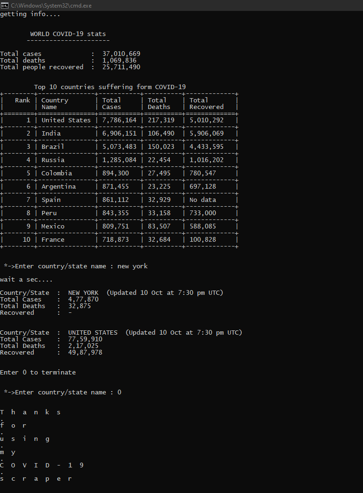

# COVID-19 scraper

*Issue [330](#330)*

Unlike other the scraper, with this one, you can even search for the stats for any particular country/state.
This script, after running, displays the following things:
1. COVID-19 stats including total cases, total deaths, people recovered.
2. Stats of top-10 countries suffering from this pandemic.
3. You can even search stats for any country or any state, searching a city name will most probably give you the stats of that state and that country in which the city exists.  

You can search an infinite number of times without exiting the script.

## Prerequisites

1. [Python 3](https://www.python.org/downloads/ "Pyhton download link")

2. Following python3 packages:
    - [BeautifulSoup4](https://www.crummy.com/software/BeautifulSoup/bs4/doc/ "BeautifulSoup's documantation")
    - [Tabulate](https://pypi.org/project/tabulate/ "Tabulate's documantation")

    *(Or just run this command in the cmd prompt `pip install -r requirements.txt`)*
3. Stable internet connection

## How to run the script

Just run the `COVID-19_scraper.py`, it will automatically display the world stats and stats of the top-10 countries.

Then it'll ask you to enter the name of country/state, please be specific with the spelling or it may show you stats of undesired country/state.

As the search query is an infinite loop, to terminate it, just enter `0` in the input field.

## Screenshot/GIF showing the sample use of the script

### This how it looks

## *Author Name*
**Yash Joglekar**

GitHub username: **[YASHBRO](https://github.com/YASHBRO)**