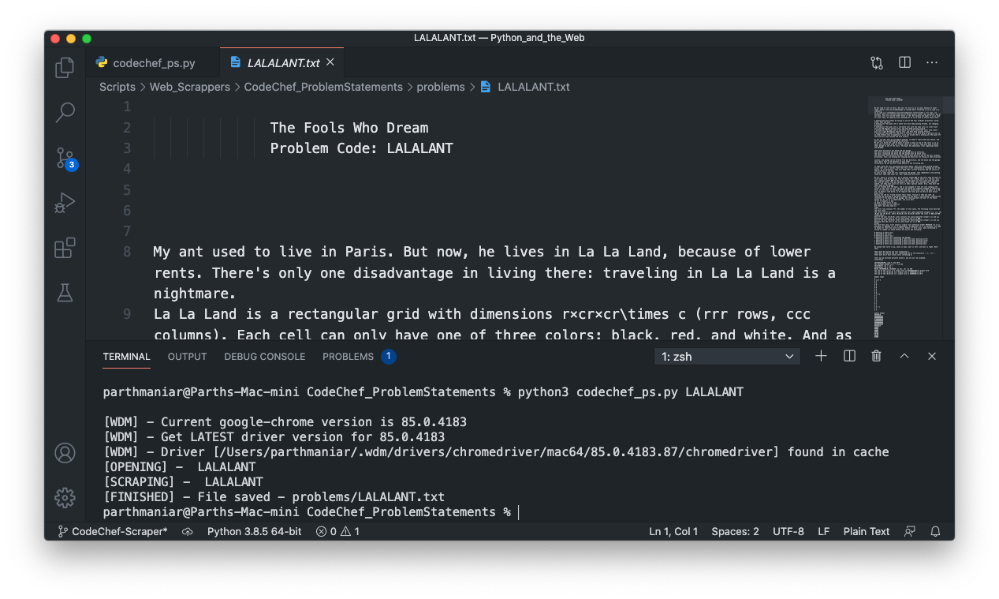

# CodeChef Problem Scraper ⚡️ 

Takes a **[`CodeChef Problem Code`](https://www.codechef.com)** as a **Command-Line Argument**, scrapes the appropriate problem statement, and saves it to a text file.

### Pre-requisites

[`Python 3`](https://www.python.org/downloads/ 'Download Python'),
[`webdriver-manager`](https://pypi.org/project/webdriver-manager/ 'Download webdriver-manager'),
[`selenium`](https://pypi.org/project/selenium/ 'Download webdriver-manager'),
[`beautifulsoup4`](https://pypi.org/project/beautifulsoup4/ 'Download webdriver-manager')

```shell
❯ pip3 install -r requirements.txt
```

### Instructions to run

```shell
❯ python3 codechef_ps.py [problem-code]
```

### Screens



## Author

**[Parth Maniar](https://github.com/officialpm)**
