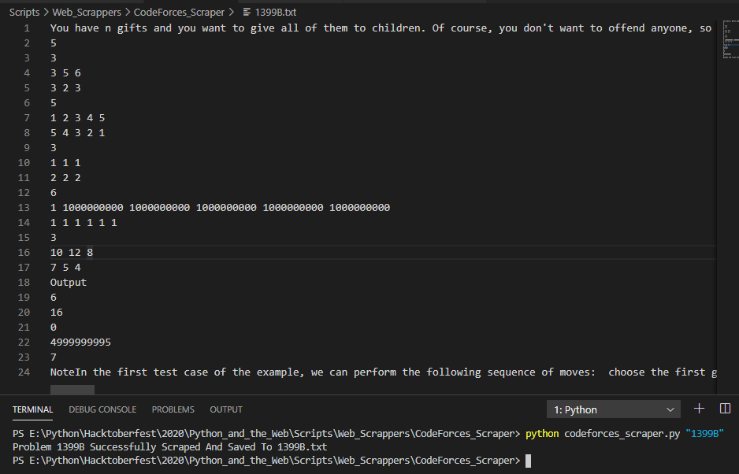

# CodeForces Problem Scraper

Takes A CodeForces Problem Code As A Command-Line Argument, Scrapes The Appropriate Problem, And Saves It To A Text File.

## Pre-Requisites

Run The Command 

`pip install -r requirements.txt`

## Instructions To Run

Run The Command

`python codeforces_scraper.py {CODEFORCES-PROBLEM-CODE}`

## Screenshot - Sample Use

## *Author Name*
[Roopesh V S](https://github.com/roopeshvs)
