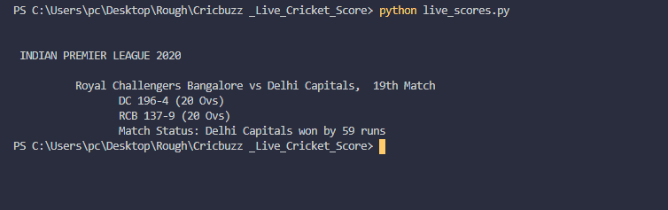

<h1 align=center>Cricbuzz - Live Cricket Score</h1>

Scrapes the cricbuzz website and displays live score and match status of each live cricket match

## *Author Name*
[Anshul Pandey](https://github.com/Anshul275)

## Pre-Requisites

Run The Command  `pip install -r requirements.txt`

## To Run the File

For Windows -  `python live_scores.py`

For Ubuntu/Linux - ` ./live_scores.py`

## Screenshots - 

### Live Score

### If cricket match not yet started

### If no live matches are found

