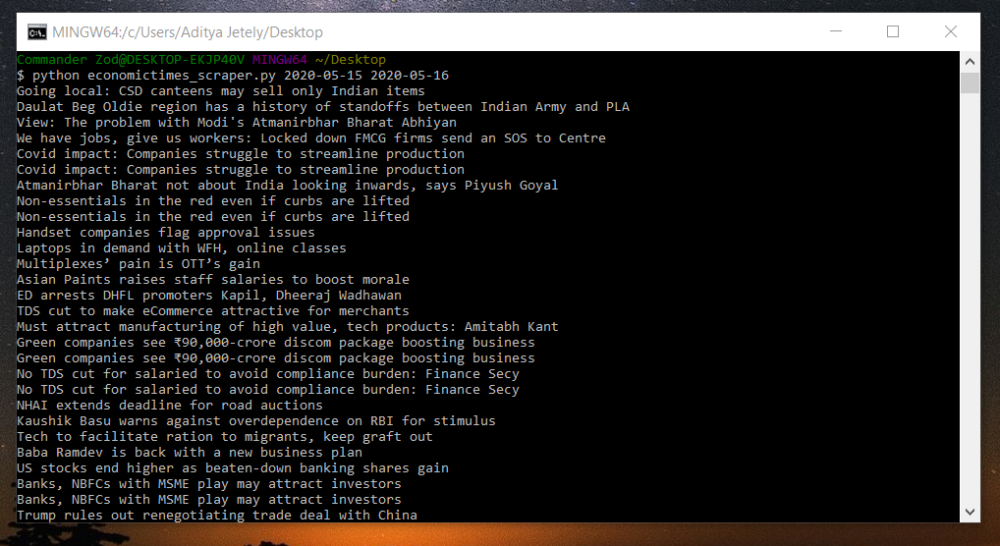

### Fetch all News Articles from Economictimes starting from a given input start date and end date.

### How to use this script?

1. Make sure all the requirements for the script are present in your system by running:

    `pip install -r requirements.txt`

2. Run the following command:

    `python economictimes_scraper.py START_DATE END_DATE`  
    where date format is `YYYY-MM-DD`

3. Example Usage
`python economictimes_scraper.py 2020-05-15 2020-05-20`  
Output will be saved in file `ET_NewsData_STARTDATE_ENDDATE.json`

## Sample use case

    

    

### Author

[Jayesh Narwaria](https://github.com/jaynarw)
