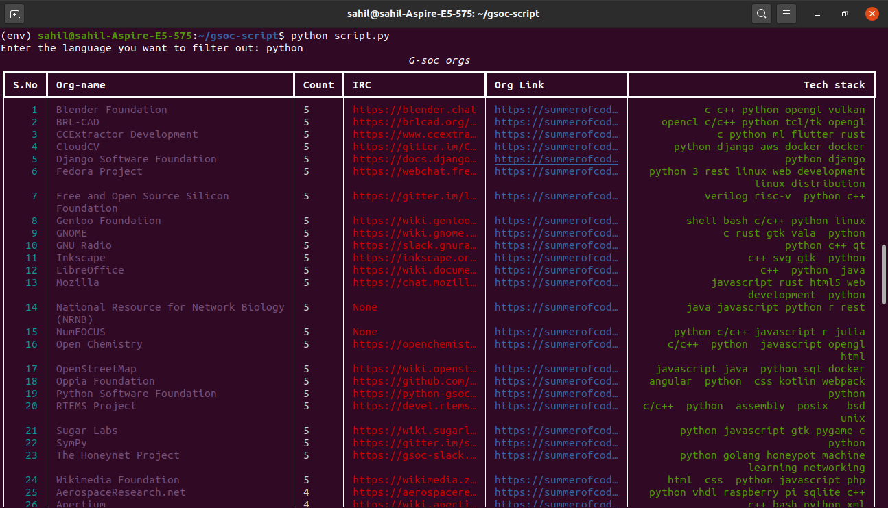
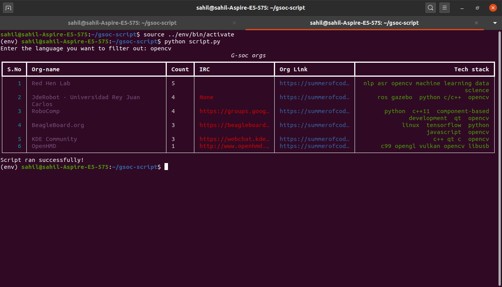

# GSoC Organisation Scraper

Scripts for lazy people like me to scrap organization list filtering out a particular language. 
Also shows the no. of times that organization was selected for GSoc in the period 2016-2020.
> Note: User can input only one langauge at time. I could add functionality for more. But I don't want to xD  

# Libraries used:
 [Requests](http://docs.python-requests.org/en/master/)  
 [BeautifulSoup](https://www.crummy.com/software/BeautifulSoup/bs4/doc/)  
 [Rich](https://github.com/willmcgugan/rich)  
 [yaspin](https://github.com/pavdmyt/yaspin/)

### Requirements :
+ BeautifulSoup
+ Requests
+ Rich
+ yaspin

### Instructions :

```bash
# Clone this repository
git clone https://github.com/imsahil007/GSoC-Scraper.git

# Go into the repository
cd GSoC-Scraper

# Install dependencies (Activate your virutal environment for python3)
pip3 install -r requirements.txt

# Run the script 
python3 script.py

# Enter the language of choice when asked.
# Example: 
Enter the language you want to filter out: python
```
### Screenshots :





## Todos:
[x] Links aren't working in table
> Note: Added a sentinal controlled loop for printing index wise details

### Contributing:
+ Fork the repo.
+ Create a new branch
+ Commit changes and make a PR.
+ PRs are welcome :)

Contact Me:  [Sahil](https://www.linkedin.com/in/imsahil007)