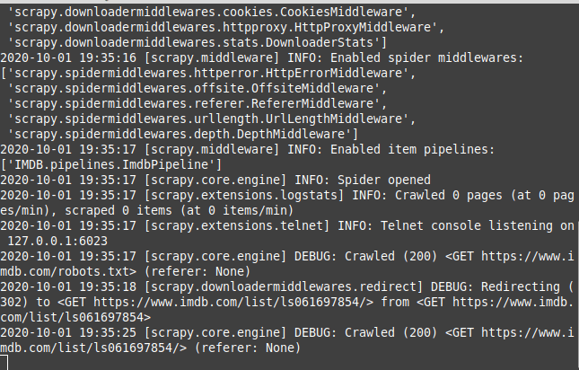

# IMDB Scraper 
  - Scrap ALL Hollywood Hindi Dubbed Movies
  - Saved Results Into DB or CSV
  - Fast af
.

### Prerequisites

* [Scrapy](https://scrapy.org/)-   Python framework for extracting the data.
*  [pymongo](https://pymongo.readthedocs.io/en/stable/#)-  Module for working with MongoDB

### Installation


```sh
Installing Scrapy
$ pip3 intstall scrapy
```


```sh
Installing pymongo
$ pip3 install pymongo
```


# How to run the script
 1.  Git clone repo
 2. Goto Project_Directory/
 3. Open Terminal/cmd
 4. scrapy crawl imdb
		
		if you want output in csv add -o filename.csv to the command.


### Screenshot/GIF showing the sample use of the script


Author
----

Apex-Code
