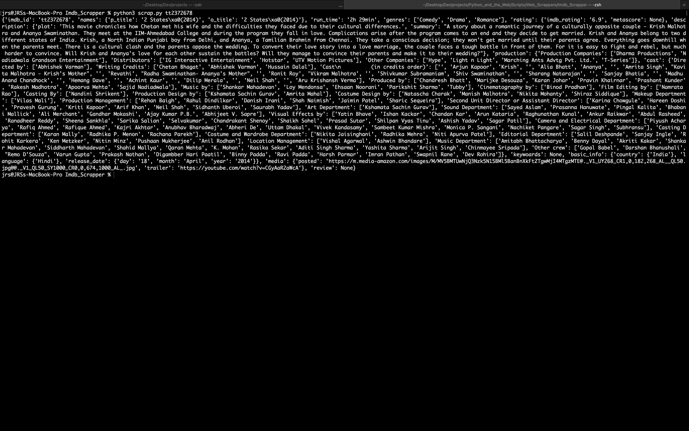

# IMDB Scrapper
---
<!--Remove the below lines and add yours -->
This script scraps the following data from imdb

**Example Output**

```json
{'imdb_id': 'tt1270797', 'names': {'p_title': 'Venom\xa0(2018)', 'o_title': 'Venom\xa0(2018)'}, 'run_time': '1h 52min', 'genres': ['Action', 'Adventure', 'Sci-Fi'], 'rating': {'imdb_rating': '6.7', 'metascore': None}, 'description': {'plot': 'A failed reporter is bonded to an alien entity, one of many symbiotes who have invaded Earth. But the being takes a liking to Earth and decides to protect it.', 'summary': "After a faulty interview with the Life Foundation ruins his career, former reporter Eddie Brock's life is in pieces. Six months later, he comes across the Life Foundation again, and he comes into contact with an alien symbiote and becomes Venom, a parasitic antihero."}, 'production': {'Production Companies': ['Avi Arad Productions', 'Columbia Pictures', 'Marvel Entertainment', 'Matt Tolmach Productions', 'Pascal Pictures', 'Sony Pictures Entertainment (SPE)', 'Tencent Pictures'], 'Distributors': ['ACME', 'ACME', 'ACME', 'Andes Films', 'B&H Film Distribution', 'Big Picture 2 Films', 'China Film Group Corporation (CFGC)', 'Continental Film', 'Falcon', 'Feelgood Entertainment', 'Forum Film', 'Huaxia Film Distribution', 'InterCom', 'InterComFilm', 'Itafilm', 'Meloman', 'Sena', 'Sony Pictures Entertainment', 'Sony Pictures Entertainment', 'Sony Pictures España', 'Sony Pictures Filmverleih', 'Sony Pictures Releasing Argentina', 'Sony Pictures Releasing Australia', 'Sony Pictures Releasing Australia', 'Sony Pictures Releasing Canada', 'Sony Pictures Releasing International', 'Sony Pictures Releasing International', 'Sony Pictures Releasing', 'Sony Pictures Releasing', 'Sony Pictures Releasing', 'Sony Pictures Releasing', 'Sony Pictures Releasing', 'Sony Pictures Releasing', 'Sony Pictures Releasing', 'Sony Pictures Releasing', 'Sony Pictures Releasing', 'Sony Pictures Releasing', 'Sony Pictures Releasing', 'Sony Pictures Releasing', 'Sony Pictures Releasing', 'Sony Pictures Releasing', 'Sony Pictures Releasing', 'Sony Pictures Releasing', 'Ster-Kinekor Pictures', 'United International Pictures (UIP)', 'United International Pictures (UIP)', 'United International Pictures (UIP)', 'United International Pictures (UIP)', 'Universal Pictures International (UPI)', 'Walt Disney Studios Motion Pictures Finland', 'Walt Disney Studios Sony Pictures Releasing (WDSSPR)', 'Warner Bros.', 'Warner Bros.', 'Amazon Prime Video', 'Netflix', 'Sony Pictures Home Entertainment', 'Sony Pictures Home Entertainment', 'Sony Pictures Home Entertainment', 'Sony Pictures Home Entertainment', 'Sony Pictures Home Entertainment', 'Sony Pictures Home Entertainment'], 'Special Effects': ['Blue Whale Studios', 'Double Negative (DNEG)', 'One Of Us', 'Sony Pictures Imageworks (SPI)', 'Double Negative (DNEG)', 'The Third Floor', 'Pixomondo', 'MPC LA', 'Nviz', 'Argon Effects', 'Proof', 'Captured Dimensions', 'Protogon', 'Legacy Effects', 'Lidar Guys', 'Nviz'], 'Other Companies': ['APM Music', 'Adrenaline Studios LV', 'Alexa', 'Allan Padelford Camera Cars', 'Allan Padelford Camera Cars', 'BT Industrial Supply', 'Blue Whale Studios', 'British Film Institute (BFI)', 'Camtec Motion Picture Camera Systems', 'Chapman/Leonard Studio Equipment', 'Chapman/Leonard Studio Equipment', 'Chapman/Leonard Studio Equipment', 'Chapman/Leonard Studio Equipment', 'Cinelease', 'City and County of San Francisco', 'City of Atlanta, GA Police Department', 'Codex', 'Columbia Pictures', 'Company 3', 'DTC Grip & Electric', 'Dolby Atmos+Vision', 'Entertainment Partners Canada', 'Global Picture Cars & Military Equipment', 'IMAX', 'International Alliance of Theatrical Stage Employees (IATSE)', 'Keslow Camera', 'LRX Lighting', 'Motion Picture Association of America (MPAA)', 'Pro-Cam Rentals', 'Pro-Cam Rentals', 'Reel Security', 'San Francisco Film Commission', 'San Francisco Police Department', 'Scarlet Letters', 'Sony Classical', 'Sony Pictures Studios', 'Team5 Aerial Systems', 'Tencent Pictures', "The Mayor's office of Film & Entertainment", 'Transportation Resources']}, 'cast': {'Directed by': ['Ruben Fleischer'], 'Writing Credits': ['Jeff Pinkner', 'Scott Rosenberg', 'Kelly Marcel', 'Jeff Pinkner', 'Scott Rosenberg', 'Todd McFarlane', 'David Michelinie'], 'Cast\n          (in credits order)\n verified as complete': ['', 'Tom Hardy', 'Eddie Brock', 'Venom', '', 'Michelle Williams', 'Anne Weying', '', 'Riz Ahmed', 'Carlton Drake', 'Riot', '', 'Scott Haze', 'Security Chief Roland Treece', '', 'Reid Scott', 'Dr. Dan Lewis', '', 'Jenny Slate', 'Dr. Dora Skirth', '', 'Melora Walters', 'Homeless Woman Maria', '', 'Woody Harrelson', 'Cletus Kasady', '', 'Peggy Lu', 'Mrs. Chen', '', 'Malcolm C. Murray', '', 'Sope Aluko', 'Dr. Collins', '', 'Wayne Pére', 'Dr. Emerson', '', 'Michelle Lee', 'Malaysia EMT', 'Riot Host', '', 'Kurt Yue', '', "Chris O'Hara", 'Astronaut JJ Jameson, III', '', 'Emilio Rivera', '', 'Amelia Young', '', 'Ariadne Joseph', '', 'Deen Brooksher', '', 'David Jones', '', 'Roger Yuan', '', 'Woon Young Park', '', 'Patrick Chundah Chu', '', 'Vickie Eng', '', 'Mac Brandt', '', 'Nick Thune', '', 'Michael Dennis Hill', '', 'Sam Medina', 'Shakedown Thug', '', 'Scott Deckert', 'Noisy Neighbor Ziggy', '', 'Lauren Richards', '', 'Jared Bankens', 'Isaac', 'Blue Host', '', 'Lucas Fleischer', '', 'Diesel Madkins', '', 'Otis Winston', '', 'Zeva DuVall', 'Little Girl', 'Riot Host', '', 'Selena Anduze', '', 'Brittany L. Smith', '', 'Jordan Foster', '', 'Jane McNeill', '', 'Victor McCay', '', 'Elizabeth Becka', '', 'Ron Prather', '', 'Marcia White', '', 'Javier Vazquez Jr.', '', 'Ellen Gerstein', '', 'Martin Bats Bradford', '', 'Steven Teuchert', '', 'Al-Jaleel Knox', '', 'Brandon Morales', 'Crowd Control Officer', '', 'Michael Burgess', '', 'Matthew Cornwell', '', 'David Fleischer', '', 'DJames Jones', '', 'Angela Davis', '', 'Stan Lee', 'Dapper Dog Walker', '', 'Wade Williams', '', 'Joseph Amey', '', 'Angelina', '', 'Randall J. Bacon', '', 'James William Ballard', '', 'William W. Barbour', '', 'Kenny Beers', '', 'Ray Benitez', '', 'Marcella Bragio', '', 'Carter Burch', '', 'Kevin Carscallen', '', 'Cabran E. Chamberlain', '', 'Kimberly Chan', '', 'Met Clark', '', 'Kim Christopher Codella', '', 'Carl Collanus', '', 'Christian Convery', '', 'M. Shawn Cunningham', '', 'Hai Dang', '', 'Cerro De la Wade', '', 'Laura Distin', '', 'Steven J. Durham', '', 'Sylvester T. Echols', '', 'James J. Fuertes', '', 'Daniela Gaskie', '', 'John Gettier', '', 'Khalid Ghajji', '', 'Apollo GT', '', 'Jake Hanson', '', 'Anthony B. Harris', '', 'Kage Havok', '', 'Tianna Hazard', '', 'Cassie Hendry', '', 'Ron Cephas Jones', 'Jack', '', 'David King', '', 'Sailor Larocque', '', 'Amy Le', '', 'Elgin Lee', '', 'Caleb Levine', '', 'Tsi Chin Li-McCall', '', 'John Lobato', '', 'Homero Lopez', '', 'Marquis Magwood', '', 'Mary Lu Marr', '', 'Van Marten', '', 'Jaydin McCollum', '', 'Jock McKissic', '', 'Robert Mello', '', 'Yvette Miner', '', 'Timothy D. Montjoy', '', 'Ed Moy', '', 'Vaughn Myovich', '', 'Ryan Newton', '', 'John Ozuna', '', 'Denney Pierce', '', 'Paul Pillsbury', '', 'Buddy Rahming', '', 'Jeff Redlick', '', 'Michael Andrew Reed', '', 'Boston Rush Freeman', '', 'Shekeb Sekander', '', 'Chris Stein', 'Mission Control Operator', '', 'Jessica Dawson Strong', '', 'JB Tadena', '', 'Cerith Taylor', '', 'Phil Tyler', '', 'Etienne Vick', '', 'William Walker', '', 'Grace Wan', '', 'A. Marshal Ward', '', 'James D. Weston II', '', 'Amanda Marie Wilkinson', '', 'Ronnie Yelverton', '', 'Mike A. Young'], 'Produced by': ['Avi Arad', 'Howard Chen', 'Edward Cheng', 'Tom Hardy', 'David B. Householter', 'Stan Lee', 'Kelly Marcel', 'Amy Pascal', 'Matt Tolmach'], 'Music by': ['Ludwig Göransson'], 'Cinematography by': ['Matthew Libatique'], 'Film Editing by': ['Alan Baumgarten', 'Maryann Brandon'], 'Casting By': ['John Papsidera'], 'Production Design by': ['Oliver Scholl'], 'Art Direction by': ['Christophe Couzon', 'Doug Fick', 'Gregory S. Hooper', 'Drew Monahan', 'Troy Sizemore', 'James F. Truesdale'], 'Set Decoration by': ['Larry Dias'], 'Costume Design by': ['Kelli Jones'], 'Makeup Department': ['Kimberly Carlson', 'Kevin Carter', 'Sarah Coy', 'Audrey Doyle', 'Stephan Dupuis', 'Mary Everett', 'Dena Fayne', 'Addison Foreman', 'Andy Fowler', 'Adruitha Lee', 'Angela Levin', 'Jonah Levy', 'Tiffany Lord', 'Kayleen McAdams', 'Tracie Morrison', 'Cassie Russek', 'Aida Scuffle', 'Kaylee Swisher', 'Jordan Venetis', 'Todd Watson', 'Jay Wejebe', 'Will Zuidema', 'Gary Archer', 'Heather Beauvais', 'Leay Cangelosi', 'Daniel McGraw'], 'Production Management': ['Preeya Kalidas', 'Jessica Parks', 'Kristen Ploucha', 'Dana Robin'], 'Second Unit Director or Assistant Director': ['Jameson Everett', 'Alina Gatti', 'Jason Halley', 'K.C. Hodenfield', 'Jeff Hubbard', 'David Keadell', 'Kevin Lum', 'Jayson Merrill', 'Adam Morgan', 'Robert Ratner', 'Spiro Razatos', 'Marlon Beyer Rieger', 'Lisa C. Satriano', 'Nick Satriano', 'Michael Saunders', 'Brittany Smith', 'Coalin Smith', 'Matthew D. Smith'], 'Art Department': ['Lauren Abrams', 'Stewart D. Allen', 'Jose Rudy Anzaldo', 'Marc Baird', 'Brian Baker', 'Andrew Bangel', 'Michael Q. Banks', 'Rick Belosic', 'Adam Bennes', 'Boyd Bossler', 'Max Bozeman', 'Christopher Brändström', 'Richard K. Buoen', 'Jason Byers', 'Michael Cawood', 'Erin Choroszylow', 'Douglas Coghlan', 'Lauren Coghlan', 'Robert Consing', 'Amanda Cornell', 'John Coven', 'Travis Craven', 'Dan Crowder', "Nick D'Abo", 'Gopinath Damodaran', 'Mallory DeGolian', 'Andi Denney', 'D. Tobias Denney', 'Steven DeSantis', 'Michael Diersing', 'David E. Duncan', 'Carl L. Durning', 'Alonzo Edwards', 'Michael Faretta', 'Kaylynn Farnan', 'Monica Fedrick', 'Matthew Lee Flory', 'Omar Foster', 'Kel Genovese', 'James Gernand', 'Alexis Gomez', 'Monty Granito', 'Vanessa Grayson', 'Wylie Griffin', 'Clark Grimes', 'Todd Harris', 'Ray Harvie', 'Mike Helbig', 'Jason Alan Hoffman', 'Peter Hudson', 'Benton Jew', 'Lynn A. Johanson', 'Scott Johnson', 'William Craig Johnson', "Riley 'Sean' Jones", 'Kevin Kalaba', 'Tommy Karasoulis', 'Tatiana Kazakova', 'Nathan Krochmal', 'Maureen Kropf', 'Tani Kunitake', 'Maxfield Ladish', 'Steven Ladish', 'Adam Lahr', 'Mari Lappalainen', 'Amy Lehman', 'Jason Redbeard Lewis', 'Anthony Liberatore', 'Josh Lusby', 'Mike Malone', 'William C. Martin', 'Stephan Martinière', 'David Masson', 'Christopher McCain', 'Jonathan McCarter', 'Daniel McEldowney', 'Brett McGinnis', 'Steve Mckean', 'Stephen McNally', 'Michael Mestas', 'John Micheletos', 'Seth Miller', 'Sam Moore', 'Ed Natividad', 'David J. Negron Jr.', 'Brian Neighbour', 'Nanci Noblett', 'William Pass', 'Giang N. Pham', 'Edward J. Protiva', 'Zane Reichert', 'Steffen Reichstadt', 'Karen Riemenschneider', 'Anna Rogers', 'Josh Roth', 'Will Sanches', 'Pio Paulo Santana', 'Ivi Schlebach', 'Kristen Sherwin', 'Joshua Shomo', 'Jeffrey D. Simon', 'Brett C. Smith', 'Meg Hyatt Snow', 'Russell Souza', 'Michelle Spreuer', 'Kevin Stepp', 'Dan Sweetman', 'Kouji Tajima', 'Susan Tanner', 'Gary Damian Thomas', 'Jeremy Turley', 'Julie Vash', 'Louis Visco', 'Joe Voltolin', 'Thomas White', 'Jerome Wilga', 'Doug E. Williams'], 'Sound Department': ['Jon Ailetcher', 'Patrick Anderson', 'Kyle Arzt', 'Kami Asgar', 'Ian Bender', 'Michael Broomberg', 'Aaron Byrnes', 'Scott Cannizzaro', 'Robert Chen', 'Patrick Christensen', 'Matt Derber', 'Will Files', 'Nerses Gezalyan', 'Jay Golden', 'Devin Golub', 'Robin Harlan', 'John Harton', 'Aaron Hasson', 'Colin Heath', 'Gary A. Hecker', 'Justin Herman', 'Scott Kinzey', 'Michael B. Koff', 'Howard London', 'Kurt Martinez', 'Ken McGill', 'Sarah Monat', 'Matthew Nicolay', "Kevin O'Connell", 'Jesse Parker', 'Ailene Roberts', 'Fred Runner', 'Randy Singer', 'Jake Slaney', 'Robert Stambler', 'Chris Terhune', 'Tim Tuchrello', 'Adrià Mateu', 'Nixon Sanchez'], 'Special Effects by': ['H. Barclay Aaris', 'Joel P. Blanchard', 'Chad Bonanno', 'Cody Bosia', 'Josh Cerven', 'Eric Cook', 'Colleen Daniel', 'Jeremy Farlow', 'Armando Franco', 'Eric Frazier', 'Roland Fullajtar', 'Skylar Gorrell', 'Barry Hart', 'Sean House', 'Heather Hutton', 'John McLeod', 'Gregory Nic Nicholson', 'Ricky Pratt', 'Alex Ramey', 'Jon Rand', 'Nick Rand', 'Robin Reynolds', 'Carlos Scally', 'J.D. Schwalm', 'Timothy Simonton', 'Gazal Tabrizipour', 'I.J. Van Perre', 'Joshua von Badinski', 'Daniel Yeager'], 'Visual Effects by': ['Borja Hernandez Abellan', 'Nathan Abreu', 'Tasmin Adams', 'Brian Adler', 'Mukund Agicha', 'Carmine Agnone', 'Lydia Aguilar', 'Nawaz Alamgir', 'Mohite Alankar', 'Clayton Albrecht', 'Marcus Alexander', 'Ryan Allen', 'Juan Alonso', 'Natalia Altavilla', 'Ana Maria Alvarado', 'Carlos Alvarez', 'Pedro Amann', 'Sneha Amin', 'Paul Amiras', 'Noah Sage Amrani', 'Robert D. Anaya', 'Anbarasu', 'Jarrod Anderson', 'Christopher Anthony', 'William Appleby', 'Alfredo Octavio Arango', 'Isabel Arboleya', 'Paul Arion', 'Arunvignesh', 'Ashin Ashroff', 'Aleksandar Atanasov', 'Alexy Auffeves', 'David Aulds', 'Crystal Awabdy', 'Abhijith Azhikkara', 'Alireza Babarahimloo', 'Thomas Bacanu', 'Habini Bae', 'Muhammad Junaid Baig', 'Kamilla Bak', 'Balaganesh', 'Daniel Baldwin', 'Tom Balogh', 'Giedre Balseviciute', 'Peiman Bandari', 'Aviv Bar-Ami', 'George Barbour', 'Judy Barr', 'Pharoah Barrett', 'Rohan Barve', 'Eric Bates', 'Addison Bath', 'Sourabh Batra', 'Alexis Baudoin', 'Boris Bauer', 'Didem Bayrak', 'Sebastian Becker', 'Rohan Bediskar', 'Manoranjan Behera', 'Marianne Bell', 'Jordan Benwick', 'Xavier Matia Bernasconi', 'Laura Bethencourt', 'Dheeraj Bhadani', 'Debjani Bhadra', 'Rasghania Bharat', 'Harshit Bhargava', 'Laksh Bhatnagar', 'Jatin Bhavsar', 'Yogesh Bhavsar', 'Leonardo Bianchi', 'Minar Bidaye', 'Thomas Biller', 'Richard Binnington', 'Jonathan Bird', 'Kyran Bishop', 'Ajay Bisht', 'Kunal Biswas', 'Jourdan Biziou', 'Brad Blackbourn', 'Josh Bleeze', 'Ryan Borah', 'Matthew Boston', 'Micha Boström', 'Dionysis Bouloutzas', 'Aharon Bourland', 'Michael Bovberg', 'Peter Bowmar', 'Dameon Boyle', 'Paul Brannan', 'Benjamin Bratt', 'Pablo M. Bravo', 'Mark Breakspear', 'Dan Breckwoldt', 'Jamie Briens', 'Cordell Briggs', 'Stuart Bruzek', 'Jeffrey Bryans', 'Bruce Buechner', 'Joan Buhigas', 'Duncan Burbidge', 'Simon Burke', 'Jake Burstein', 'Thomas J. Burton', 'Inês Caiola', 'Daniel Cairnie', 'John Caldwell', 'Earle Stuart Callender', 'Doug Campbell', 'Angel Cano', 'Keanan Cantrell', 'Brian Carney', 'Dan Carpenter', 'Ean Carr', 'Antonio Carranza Pérez', 'Marcello P. Carvalho', 'Paul Cayrol', 'Dara Cazamea', 'Anthony Chadwick', 'Saptarshi Chakraborty', 'Aleksandar Chalyovski', 'Cori Chan', 'Srikanth Chandu', 'Petar Chardakov', 'James Charles', 'Abhisek Chatterjee', 'Abhishek Chaturvedi', 'Prafull Chauhan', 'Rosemary Chester', 'Keith Cheuk', 'Milind Chogle', 'Caleb Choo', 'Céline Chotard', 'Deepak Choudhary', 'Ishwar Chougule', 'Stefano Cieri', 'Erik Classen', 'Corey Coates', 'Megan Collinson', 'Ben Conrad', 'Emily Cook', 'Sean Coonce', 'Ian Copeland', 'Barry Corcoran', 'Irene Cordero', 'Oliver Cordwell', 'Francesco Cosatti', 'Chad Cox', 'Mathew Crisp', 'Ruxandra Cristoiu', 'Kristofer Cross', 'Lucas Manuel Cuenca', 'Jing Cui', 'Andy Cuthbert', 'Inëz Czymbor', "Marco D'Ambros", 'Onkar Ashok Dahare', 'Alistair Darby', 'Virender Dass', 'Markus Daum', 'Alex Davis', 'Jose Maria de la Puente', 'Michael DeBeer', 'Johan Dekker', 'Michael Deliso', "Giulia Dell'Armi", 'Andrew Deneau', 'Mahesh Desai', 'Joshua Devenyi', 'Dhananjayan', 'Giovanni Di Giulio', 'Maurizio Di Vitto', 'Raffael Dickreuter', 'Bhavya Dixit', 'Justin Dobies', 'Andrew Dohan', 'Vincent Domaigné', 'Jason Donnelly', 'Sam Doolan', 'Melanie Dorn Carter', 'Markus Drayss', 'Nelson Dsouza', 'Florian Dubois', 'Geer DuBois', 'Sheena Duggal', 'Arnaud Dumeyni', 'Ben Duncan', 'Adrien Dupont', 'Katherine Durant', 'Alok Dwivedi', 'Amit Kumar Dwivedi', 'Christopher Edwards', 'Dominic Edwards', 'Richard Edwards', 'Amin Eftekhar', 'Ole Geir Eidsheim', 'Elmar Bragi Einarsson', 'Bernhard Eiser', 'Marc Ellis', 'David Emeny', 'Jenn Epstein', 'Javier J. Espinoza', 'Pedro Fernandes Santos', 'Ritonia Fernandes', 'Susana Fernández Casco', 'Antonella Ferrari', 'George Ferris', 'Dru Fickling', 'Kelly Fischer', 'Lee Fisher', 'Kimberley Fitch', 'Dan Edward Fitzgerald V', 'Daniel Fitzgerald', 'Carlos E. Flores', 'Heather Flynn', 'Filippo Forno', 'Hermione Francis', 'Paul J. Franklin', 'Simon Fraser', 'Federico Frassinelli', 'Claudia Fugazzotto', 'Kyoko Fukushima', 'Reinaldo Furegato', 'Zoe Furness', 'Gábor Fóner', 'William Gabriele', 'Aman Gahlot', 'Alvaro Gasco', 'Jenny Gauci', 'Sanchit S. Gavale', 'Ankush Gawande', 'Federico Ghetta', 'Nikhil Ghoorbin', 'Paolo Giandoso', 'Justas Giedraitis', 'Daniel Gilligan', 'Pablo Giménez', 'Neil Glasbey', 'Adley Glemaud', 'Julian Gnass', 'Emanuele Goffredo', 'Carsten Gomes', 'Catarina Gonçalves', 'Chris Gooch', 'Arushi Govil', 'Brendan Grady', 'Oded Granot', 'Andrea Grappis', 'Luke Gray', 'Emily Greeley', 'Chris Grifasi', 'David Griffith', 'Alison Griffiths', 'Neil Griffiths', 'Johnny Grilo', 'Gero Grimm', 'Erik Griott', 'Gina Guerrero', 'Sian Gunningham', 'Xin Steve Guo', 'Vikas Gusain', 'Victor Gutarra', 'Andrés Gómez Tollar', 'Crystal Hadcroft', 'Martin Hall', 'Harry Hamblin', 'Raphael Hamm', 'Brian Hanable', 'Guy Hancock', 'Pete Hanson', 'Luke Hardisty', 'Jiten Harkhani', 'Ty Harmon', 'Rio Harrington', 'Dylan Harris', 'Jason Harris', 'Alex Conor Harrison', 'Mark Harrison', 'Patrick Haskew', 'Nick Hatzichristos', 'Gabriel Hennessy', 'Marie-France Henri', 'Joachim Henriksen', 'Justin Henton', 'Etay Herz', 'David Hickey', 'Mike Hill', 'Jani Hiren', 'Nina Helene Hirten', 'Tom Hocking', 'Cássio Homa', 'Yuka Hosomi', 'Tushar Hote', 'Julian Howard', 'Beth Howe', 'Pete Howlett', 'Matt Howsam', 'Katie Hoyt', 'Jiaxuan Hu', 'Shih Ling Huang', 'Levon Hudson', 'Monica Rodriguez Huertas', 'Josh Huitema', 'Michael Hull', 'Ben Imber', 'Ilaria Introzzi', 'Ciprian Iorga', 'Balakrishna Isunuri', 'Nick Jacks', 'Adam Jackson', 'Caleb Jackson', 'Santosh Jakkam', 'Gediminas Max Jauga', 'Arudra Jaykar', 'Tankodra Jaykishan', 'Jack Jenkins', 'Steven Qi Jin', 'Jan Jinda', 'Inki Jo', 'Adam Johannesson', 'Therese Johansson', 'Abhinaw John', 'Siddarth John', 'Hannah Johnson', 'Helen Johnson', 'Katie Johnson', 'Phil Johnson', 'Suvi Jokiniemi', 'Joseph Jones', 'Deepak A. Joshi', 'Vikrant Joshi', 'Tom Judd', 'Aman Juneja', 'Adam Kajder', 'Shamintha Kalamba Arachchi', 'Sean Kalra', 'Swapnil Kamle', 'Anurag Kapil', 'Ceyhan Kapusuz', 'Vasilis Karatziva', 'Vinay Karunakar', 'Adithya Kashyap', 'Manickam Kathirvel', 'John Kay', 'Simon Kay', 'Ciarán Keenan', 'Daniel Kemeys', 'Shanu Khalifa', 'Santosh S. Khedkar', 'Sagar Khorasia', 'Thomas Kidd', 'Eddie Kim', 'Ryan Kirtack', 'Matt Knight', 'James Knowles', 'Florian Koebisch', 'Matthew Koehler', 'Srinivasa Raghavendra Kondapuram', 'Dean Koonjul', 'Allie Koppel', 'Ashlesh Kotangale', 'Mark Koval', 'Makoto Koyama', 'Ian Krassner', 'Harry Robert Krimm', 'Václav Kubant', 'Zuzanna Kucharska', 'Annurup Kumaar', 'Sujay Kumar G.', 'Divya Kumar Vij', 'E. Suresh Kumar', 'Udaya Kumar', 'Vishal Kumar', 'Nibha Kumari', 'Dan Kunz', 'Balendu Kurup', 'Kushank Tikku', 'George Kyparissous', 'Sydney Dimitra Kyrtsia', 'Daniel Labossiere', 'Lakshmanakumar', 'David Lamb', 'Thomas Lambert', 'Pascale Lamoureux-Miron', 'Josh Lange', 'Kate Lapina', 'Douglas Larmour', 'Mark Larranaga', 'Philip Larson', 'Victor Latour', 'David Lee', 'Raphael Legros', 'Erik Lehmann', 'Dimitris Lekanis', 'Janek Lender', 'Jesse Lewis-Evans', 'Da Li', 'Wei Li', 'Pierson Lippard', 'Shenyan Liu', 'Steven Lo', 'Daniela Lobo Dias', 'Jacob Victor Lobo', 'Andrew Lockley', 'Prasad Aaksha Lohith', 'Daniel Long', 'Javier Lopez-Duprey', 'Kumbu-Ki-Lutete Lord Ted Mabika', 'Geoff Lou', 'Leah Low', 'Kate Lowe', 'Alicia Lowndes', 'Jakob Lundbye', 'Trent Lundquist', 'Bruno Lévêque', 'Melaina Mace', 'Peter Machuca', 'Francesco Antonio Maggi', 'Sanjay Mahajan', 'Dipen Majmundar', 'Michael Maker', 'Ashish Malhotra', 'Kevin Maliakal', 'Sameer Malik', 'Chris Manabe', 'Giovanni Manili', 'Liz Mann', 'Dominic Martin', 'Jose Martin', 'Rafael Martins', 'Marc Mason', 'Alessandro Mastandrea', 'Trevin Matcek', 'Daniel Maund', 'Michael Hall Mauritzen', 'Amit Mazumder', 'Matt McClurg', 'Daniel McCue', 'Jason McDonald', 'Aimee McKinney', 'Renee McShane', 'Shane Meehan', 'Tamara Meem', 'Himanshu Meena', 'Joel Meire', 'Jeremy Meltzer', 'Rosanna Mennear', 'Kiran Menon', "Mike 'Moe' Merell", 'Javier Meroño', 'Carmen Metcalf', 'Midhun', 'Benjamin Milling', 'Maria Mira', 'Ankur Mishra', 'Vishal Mishra', 'Eric A. Mitchell', 'Sayani Mitra', 'Souvik Mitra', 'Akmal Mlahaili', 'Sunil Mohapatra', 'Farhad Mohasseb', 'Kobi Moldavski', 'Eric Moliner', 'Damiano Moltisanti', 'Oliver Money', 'Sandrine Moniez', 'Jeremy Mooney-Somers', 'Ahmed El-Shahat Moustafa', 'Tom Mulhall', 'Matthew Mullarkey', 'Aj Mulley', 'Chris Munns', 'Muruganantham', 'Prakash Murughendra', 'Jayaraj Muthukumar', 'Jason G. Myers', 'Sven Müller', 'Sunny Nair', 'Ali Nakipoglu', 'Buchi Ramulu Narsingoju', 'Deepak Nayak', 'Livi Naylor', 'Dan Neal', 'Devesh Neema', 'Charlotte Nelson', 'Donald Netzel', 'Paul Newberry', 'Kat Newington', 'Lukas Niemczyk', 'Siraphurin Nimmahnratanakul', 'Tyler Nishikawa', 'Yashwanth Noogala', 'Victor Norberg', 'Tom Norman', 'Kevin Norris', 'Mariluz Noto', 'Ana Nunes', "Tabitha O'Connell", "Matthew O'Sullivan", 'Jeremy Oddo', 'Alok Ogale', 'Gildon Oh', 'Artemis Oikonomopoulou', 'Alice Olson-Coons', 'Megan Omi', 'Jaime Ormston', 'Miguel Angel Ortiz Rivera', 'Kurian Os', 'Ahmed Osman', 'Naoki Oyagi', 'Dustin Padgett', 'Chirag Padlekar', 'Christy Page', 'Suman Paik', 'King Louie Palomo', 'Konstantinos Panagiotopoulos', 'Suvesh Panda', 'Praveen Kumar Sharma Parasnath', 'Phanie Parent', 'Brice Parker', 'Prithvi Parmar', 'Rohan Parmar', 'Bisen Parth', 'Balasubramani Parthasarathy', 'Lucas Pascale-Pallotta', 'Lucia Pascali', 'Saurabh Patel', 'Mustakeem Pathan', 'Daniel Paulsson', 'Stephen J. Pavelski', 'Giorgio Pennisi', 'Angelica Perez', 'Samuel Perkins', 'Dennis Petkov', 'Petko Petkov', 'Kevin Phelps', 'Lloyd Phillips', 'David Picarda', 'Alessandro Pieri', 'Damien Pierlot', 'Ezra Pike', 'Melvin Mathew Pillai', 'Gianluca Pizzaia', 'John Ployhar', 'Ariele Podreider Lenzi', 'Travis Porter', 'Mayuresh Powar', 'Donna Poynton', 'Prabhakher', 'Mahajan Prashant', 'Kristin Pratt', 'Padiyachi Premraj', 'Andrew Prescott', 'Henry Preston', 'Francis Prince', 'Richard Pring', 'Jakub Pruszkowski', 'Vivek Pundir', 'Lauren Puntillo', 'Robin Purdy', 'Risto Puukko', 'Sadjad Rabiee', 'Eugene Rachevsky', 'Michele Rader', 'Radhakrishna', 'Marko Radinkovic', 'Indreep Raha', 'Jesper Rahlff', 'Imran Ahmed Raichuri', 'Sathya Rajarajan', 'Sreehari Ramakrishna', 'Kieron Ramchurn', 'Nick Rampling', 'Gaurav Rane', 'Victoria Rank', 'Prabhamrit Raryan', 'Reachmenobin', 'Tom Reagan', 'James Rees', 'Matthias Reiche', 'Gábor Reikort', 'Shinichi Rembutsu', 'Simon Renaud', 'Renganath', 'Jordan Rice', 'Radost Ridlen', 'Pasquale Riefoli', 'Evelyne Robert', 'Ed Roberts', 'Travis Robinson', 'Daniel Rodrigues das Neves', 'Chus Rodriguez', 'Ismael Alabado Rodriguez', 'Patrick J. Rodriguez', 'Rogelio Rodriguez', 'Antonio Rodríguez Díaz', 'Ryan D. Romero', 'Jason Ronzani', 'Sergio Rosas', 'Sean Rourke', 'Rajat Roy', 'Margarita Rozas Málaga', 'Jake Rusch', 'Ash Ryan', 'Bryan Ryan', 'Hossein Sabouri', 'Matt Sadler', 'Sneha Saji', 'Anjum Sakharkar', 'Alicia Saleh', 'Herbert Samson', 'Henning Sanden', 'Ghosh Sanjay', 'Kushwaha Sanjay', 'Romeo Ulalan Santos', 'Sabin Sasidharan', 'Sathishbabu', 'Kimberly Scarsella', 'Alessandro Schiassi', 'Fons Schiedon', 'Matthew Silver Schitkovitz', 'Eric Schultz', 'Eduard Schulze-Battmann', 'Shaun Scott', 'Peter Seager', 'Alexander Seaman', 'Nicolas Seck', 'Wakako Sekine', 'Balasubramaniam Senthil Kumar', 'SenthilBalu', 'Seshaprasad', 'Nathaniel Seymour', 'Fiaz Shaikh', 'Aurora Shannon', 'Samuel Shannon', 'Deepakkumar Sharma', 'Jonathon Sheffield', 'Sufiyan Sheikh', 'Matthew Sherwood', 'Pratik Shevalkar', 'Terry Shigemitsu', 'Sammy Shikaze', 'Ahmed Shoaib', 'Arpit Shukla', 'Erik Shveima', 'Ankur Singh', 'Gaurav Singh', 'Monu Singh', 'Nitin Singh', 'Pratik Pradeep Singh', 'Rajinder Singh', 'Ranvir Singh', 'Vinay Pratap Singh', 'Matt Skuta', 'Scott Slater', 'Cristian Slavik', 'Dane Allan Smith', 'Megan Louise Smith', 'Stephen J. Smith', 'Nikki Snider', 'Jean-Leny Sole', 'Mark G. Soper', 'Satish Kanta Sorensangbam', 'Bernardo Andrea Spadafora', 'Andrew Spalding', 'Srikrishna', 'Tatampudi SrinivasaRaju', 'Anshul Kumar Srivastava', 'Sonal Srivastava', 'Mihai Stan', 'Jim Steel', 'Anesh K Steephen.', 'Monica Stefanelli', 'Irena Steinnagel', 'Eric Stewart', 'Grant Storrie', 'Eline Strijdonk', 'Mary Stroumpouli', 'Fiona Stuart-Clark', 'Nico Sugleris', 'Nandu Sulochanan', 'Jane Sun', 'Sundar', 'Ashutosh Surawshi', 'Phoebe Sutherland', 'Apurv Swami', 'Swarnadeep', 'Michael J. Sweetser', 'Szabolcs Szmicsek', 'Ranko Tadic', 'Graham Tailleur', 'Amelie Talarmain', 'James Tam', 'Ben Taylor', 'Bridget M. Taylor', 'Cedric Joel Tchouta Tchoubith', 'Werner Ten Hoeve', 'Benoit Terminet Schuppon', 'Shashank Thakur', 'Christopher Thellas', 'Amy Thomas', 'Johnson Thomasson', 'Kire Timov', 'Dan Tindell', 'Rohan Tirkey', 'Anoop Tiwari', 'Pawan Tiwari', 'Steve Tizzard', 'Steven Tom', 'Jessica Ton', 'Connor Tong', 'Chris Tost', 'Fabio Tovar', 'Jean-Philippe Traoré', 'John-John Traoré', 'John Treusch', 'Alla Trinadh', 'Adam Trowse', 'Jesse Turnbull', 'Emily Unruh', 'Ajay Upadhyaya', 'Viral Vadalia', 'Venkat Vadisetti', 'Marco van der Merwe', 'Christopher Vance', 'Carl Vazquez', 'Luis Vega', 'Elena Velkova', 'Marjolein Verheij', 'Wesley Vet', 'Leo Vezzali', 'Venu Victor', 'Melisande Vigeant', 'Erica Vigilante', 'VikramSampath', 'Chetan Vishwakarma', 'Shiv Kumar Vishwakarma', 'Sachin Vishwas', 'Mael Vortemann', 'Adam Walker', 'Danny Walker', 'Jordan Walsh', 'Jiayin Wang', 'Pablo Wang', 'Claudia Warman', 'Chris Waters', 'Cameron Weaver', 'Kenneth Weide', 'Christoph Westphal', 'Prasad Wharavadekar', 'Huw Whiddon', 'Steve White', 'Stephanie Whitmarsh', 'Rudy Wijaya', 'Scott Wilkinson', 'James Willingham III', 'Chris Wilson', 'Stephanie Winslow', 'Ammann Christine Wong', 'Eric Hp Wong', 'Seungjin Woo', 'Adam Woodfield', 'Shendy Wu', 'Saxson Xavier', 'Sunil Kumar Yadav', 'Casey Yahnke', 'Tiffany Yee', 'Rajashekar Yeligondla', 'Seda Yilmaz', 'Alexander Yip', 'Kristen Young', 'Sophia Yu', 'Michael Zannetou', 'Alexandra Zedalis', 'Alvaro Zendejas', 'Nessa Mingfang Zhang', 'Cleve Yilun Zhu', 'Derek Zivolich', 'Simone Zuccarini', 'Monica Østbø Østgård', 'Akhil_kp', 'Emil Alagjozovski', 'Ruben Gerardo Alfaro Moreno', 'Robin Beard', 'Marc Bonneviot', 'Ryan Chow', 'Sean Cooper', 'Chad Cox', 'Michael Dolan', 'Eddy Durnan', 'Fabian García', 'Chris Kessler', 'Rajasekar Kn', 'Julia Lou', 'Chiaki Matsubayashi', 'Tom Minor', 'Sophie Newton', 'Larry Ngo', 'Bhanu Pratap Rathore', 'Chus Rodriguez', 'Alessio Rosio', 'SankarRajendran', 'Jinali Shah', 'Kankuro Suzuki', 'Joseph Towe', 'Fannar Traustason', 'Yoshi Vu', 'Wing Kit Yu', 'Shawna Zegarra'], 'Stunts': ['Keith Adams', 'Matthew R. Anderson', 'Ben Aycrigg', 'Gregory J. Barnett', 'Loyd Bateman', 'Brandon Beckman', 'Randy Beckman', 'Chad Bowman', 'Joe Bucaro III', 'RJ Casey', 'David Conk', 'Tim Connolly', 'Erik Cord', 'Wally Crowder', 'Phil Culotta', 'Jahnel Curfman', 'Cory DeMeyers', 'Joe Dryden', 'John Escobar', 'Jonathan Quinn Escobar', 'Dane Farwell', 'Bj Fisher', 'Monique Ganderton', 'Khalid Ghajji', 'Andy Gill', 'Jack Gill', 'Katie Gill', 'Kelly Gill', 'Daniel Graham', 'David M. Graves', 'Daniel Hargrave', 'Craig Henningsen', 'Daniel Hernandez', 'Sara Holden', 'David Hugghins', 'C.C. Ice', 'Kirk A. Jenkins', 'Henry Kingi', 'Brionna Lynch', 'Jalil Jay Lynch', 'Adam Lytle', 'Robbie Maddison', 'Ryan Mari', 'Jeremy Marinas', 'Aaron Matthews', 'Michael McGuire', 'Kyle Mclean', 'Spencer Mulligan', 'Niko Nedyalkov', 'Daniel Norris', "Chris O'Hara", 'Joe Ordaz', 'Charlie Picerni', 'Denney Pierce', 'Quinn Pierce', 'Spiro Razatos', 'Jimmy N. Roberts', 'Cody Robinson', 'Mike Ryan', 'Eric Salas', 'Craig Frosty Silva', 'Brian Simpson', 'Nick Stanner', 'Remington Steele', 'Anastajah Sterns', 'Justin Sundquist', 'Don Thai Theerathada', 'Jacob Tomuri', 'Keil Oakley Zepernick', 'Keith Adams', 'David Alessi', 'William W. Barbour', 'Michael H. Barnett', 'Adam Basil', 'Brandon Beckman', 'JoAnn Bernat', 'Chad Bowman', 'Joe Bucaro III', 'Rico Burgos', 'Max Calder', 'Jwaundace Candece', 'Rocky Capella', 'Jennifer Caputo', 'RJ Casey', 'Pat Chu', 'Tye Claybrook Jr.', 'Bruce Concepcion', 'David Conk', 'Shawn Crowder', 'Keith Splinter Davis', 'R.J. De La Fuente', 'Calvin Dean', 'Greg Dela Riva', 'Cory DeMeyers', 'Joe Dryden', 'Kevin Dyer', 'Richard Epper', 'John Escobar', 'Jimena Ferrante', 'Jacob Garcia', 'Khalid Ghajji', 'David M. Graves', 'Jason Gray', 'Michael Hansen', 'Regis Harrington', 'Alexander Hashioka Oatfield', 'Zac Henry', 'Daniel Hernandez', 'Jason Charles Hill', 'Sara Holden', 'Tony Hunt', 'C.C. Ice', 'Kris A. Jeffrey', 'Michael D. Jenkins', 'Brett A. Jones', 'Steve Kelso', 'Jess King', 'Dorian Kingi', 'Henry Kingi', 'Brionna Lynch', 'Jalil Jay Lynch', 'Adam Lytle', 'Ryan Mari', 'Jeremy Marinas', 'Richard Marrero', 'Michael McGuire', 'Polly Mitchell Giles', 'T. Ryan Mooney', 'Dave Moro', 'Mike Mukatis', 'Robert Nagle', 'Jessica Nam', 'Niko Nedyalkov', 'Darlene Nesson', 'Leon Ngo', 'Anthony Nguyen', 'David Will No', 'Jane Oshita', 'Michael Owen', 'Allan Padelford', 'Woon Young Park', 'Natasha Paul', 'Ricardo Perez', 'Matt Philliben', 'Charlie Picerni', 'Jeff Redlick', 'Jimmy N. Roberts', 'Kelly Róisín', 'Ayami Sakaeda', 'Maya Santandrea', 'Jon Walker Schmidt', 'Courtney Schwartz', 'Timothy Scott', 'Robert Shavers', 'John J. Shim', 'Donn Andrew Simmons', 'Brian Simpson', 'Remington Steele', 'Eric Stratemeier', 'Phil Tyler', 'Jaye Tyroff', 'Jose Vasquez', 'Tony Vo', 'Thom Williams', 'Nancy Young', 'Keil Oakley Zepernick'], 'Camera and Electrical Department': ['Phillip Abeyta', 'Alfred Ainsworth Jr.', 'Joseph J. Allen', 'Michael Ambrose', 'Nick Anderson', 'Reid Andrews', 'Eric Androvich', 'Greg Baldi', 'Robert Barcelona', 'Mark William Bassett', 'Nick Behrmann', 'Troy Benjamin', 'Tigris Bergman', 'John Betancourt', 'Mike Black', 'Gabriel Blain', 'Steven Blizzard', 'Jason Boccaleoni', 'Ashley Bond', 'Mike Booth', 'Jeffrey Bordessa', 'Elliott Boswell', 'Keith Bratton', 'Geoff Bremner', 'Shannon Bringham', 'Cordis Brooks', 'Conrad Brown', 'Michael Ryan Burns', 'Graham Byrnes', 'Ryan J. Calkin', 'Nick Cannon', 'Michael Cape', 'Tony Carmean', 'Alex Carr', 'Carlos Castrillon', 'Bill Cendak', 'Dave Childers', 'Gregory M. Childers', 'Peter Chrimes', 'Ian Chriss', 'Jeffrey N. Civa', 'Josh Cleland', 'Jay Coakley', 'Gregory Collis', 'Justin Cooley', 'Dan Cornwall', 'Eric Arnold Cortez', 'Andrew Crankshaw', 'Catherine Cravens', 'Lauren Elizabeth Cummings', "James 'Spud' Danicic", 'Will Dearborn', 'David Deever', 'Bryce Denton', 'Thomas DeRose', 'Nicholas Dias', 'Michael Duarte', 'Stephen Dubay', 'Tana Dubbe', 'Fred Duffer', 'Zach Dunlap', 'Cooper Dunn', 'Christopher Kevin Duran', 'Gregg Easterbrook', 'Terry Eden', 'Rusty Edmonson', 'Kenneth D. Emanuele', 'Derrick Esperanza', 'Michael Estes', 'Jake Ferrero', 'Jeff Ferrero', 'Mike Fischer', 'Bryan Fletchall', 'Michael-Ryan Fletchall', 'Shawn Fossen', 'Dale Fowler', 'Nathan Freeman', 'David Garza', 'Keith Gaynor', 'Jordan Gehrig', 'Mike Gentilini Jr.', 'Mike L. Germaine', 'Dan Godar', 'Peter Graf', 'Jeff Griffith', 'Amnol Gupta', 'Jacques Haitkin', 'Josh Hancher', 'Jordan Harriman', 'Adam Harrison', 'Scott Hatley', 'Matthew Hawkins', 'Joe Heath', 'Brad Heiner', 'Frank Helbig', 'Don L. Henderson', 'Jimmy Hendrix', 'Andrew Heron', 'Chris Herr', 'Jessica Hershatter', 'Sean Higgins', 'Sammy Ray Hill', 'John Holmes', 'Christian Hoobyar', 'Jason Hooper', "Jeff 'Moose' Howery", 'Paul Hughen', 'Jeremy Hughes', 'Darryl Humber', 'Richard A. Hunt', 'Ronald H. Hynson', 'Bogdan Iofciulescu', 'Mat Irby', 'Elton Hartney James', 'Jeb Johenning', 'Brook Johnson', 'Evan Jones', 'Jordan C. Kadovitz', 'Hiro Kakuhari', 'Jason Kay', 'Nicholas Kay', 'Aaron Kirby', 'Michael Kowalczyk', 'Ernie Kunze', 'Garrett Kushner', 'Rudy Lamur', 'Nathan Lee', 'Daniel John Lerch', 'Austin J. Lewis', 'Nikolaus Beckett Lindberg', 'Sam Lino', 'Kyle Lippincott', 'Jordan Livingston', 'Justin M. Lubin', 'Chris Lumpkin', 'Wayne Mann', 'Raul J. Marin', 'Larry Markart', 'Tim Marshall', 'Wayne Marshall', 'Frank Masi', 'Nick Masters', "Robert 'Boomer' McCann", 'Matthew C. McCarthy', 'Bill McConnell Jr.', 'Chris McCracken', 'Joshua McCready', 'David William McDonald', 'Robert McFall', 'Christopher TJ McGuire', 'Igor Meglic', 'Luke Messick', 'Kevin Miles', 'Jason Miller', 'Chris Montgomery', 'Christopher Montgomery', 'Scott Montgomery', 'Christopher William Moore', 'Jean Vande Moortel', 'Duncan More', 'Christofer Moscoso', 'Spencer Mulcahy', 'Hassen Muralles', 'Adam Murray', 'Mark Nakahara', 'Darin Necessary', 'Drew Nelson', 'Justin Noel', 'Louie Northern', 'Robert Novellino', 'Dylan Novicky', 'David B. Nowell', 'Annabelle Nutt', "Nicolas 'Nico' Ortiz y Pino", 'Craig R. Owens', 'Joseph Harold Page', 'Onofrio Nino Pansini', 'Austin Peck', 'Robert Thomas Pedroza', 'Mickey Petersen', 'Morten Petersen', 'Raul Peña', 'Mary Margaret Porter', 'Jason Predock', 'Mila Puccini', 'Lisa Quinn', 'Kerry Rawlins', 'Eddie A. Reid IV', 'Paris Rich', 'Benoit Richard', 'Nathan Rigaud', 'Jeff W. Rios', 'Kenny Rivenbark', 'Jason Robbins', 'Sean Roberts', 'Dennis Rogers', 'Nick Rowland', 'Nelson Saarni', 'Robert M. Sagaser', 'Chris Sanders', 'David Schmalz', 'Taylor Schultz', 'Nito Serna', 'David Shakibanasab', 'Clyde Sharman', 'James C. Sharpe', 'Matt Shearer', 'Chris Shellenberger', 'William Shore', 'Michael Shortt', 'Jake Simmons', 'David Skinner', 'Stewart Smith', 'Katrienne Soulagnet', 'Dean Southan', 'Roxanne Stephens', 'Jeff Sterner', 'Todd Stoneman', 'Kevin Sullivan', 'Terry Sullivan', 'Jeff C. Sutton', 'Jason Talbert', 'Ricky Tayerle', 'Sean Taylor', 'Jennifer Terrell', 'Peter Thoren', 'Erick Thundercloud', 'Nick Thursby', 'Manning Tillman', 'Bob Tingle', 'Clark Todd', 'Chris Tolan', 'Nicholas Tredway', 'Cody Preston Troxell', 'Patricia Tuck Tuckwiller', 'Mike Tyson', 'Oscar Valdivia', 'Grant Valentine', 'Alan Vance', 'Melissa Vilardo', 'Andy Waldron', 'John Warner', 'Joel C. Warren', 'Victoria K. Warren', 'Grace E. Weibenga-Sanford', 'Court Wheeler', 'Brad Wilder', 'Theresa Wong', 'Cameron Woodall', 'Darrell Szarka Workman', 'Gill Wright', 'Daniel Wurschl', 'Satoshi Yamazaki', 'Aaron G. York', 'George Zador', 'Alex Zeh', 'Wilson Zhang', 'Peter Zuccarini'], 'Animation Department': ['Leonardo Bonisolli', 'Umit Calik', 'Sukanta Nihar Chakraborty', 'Renjith Chundakkad', 'Evan Clover', 'Karna Contractor', 'José Luis de Lucas', 'Ben Goerlach', 'Tomas Gutierrez Fernandez', 'Ihor Hurin', 'Trystan James', 'Annie Jan', 'Gábor Kiss', 'Anukalp Kulshreshtha', 'George Meppadath Kurian', 'Sherin Mahboob', 'Alvaro Martin', 'Charly Mauri', 'Joel Meire', 'Andrew Mills', 'Martin Moch', 'Giacomo Mora', 'Benoit Moranne', 'Gwilym Morris', 'Rajesh P.K.', 'Christopher Page', 'Benoit Paillard', 'Thomas Phillips-Howard', 'Jack Preston', 'Jaco Pretorius', 'Karunakar Reddy', 'Benjamin Reicher', 'Carlos M. Rosas', 'Martin Rossi', 'Jay Roxas', 'Dan Santos', 'Suku Sibi.K.', 'Emanuel Strixner', 'Joe Tarrant', 'Rekha Thorat', 'Oskar Urretabizkaia', 'Bernard Wicksteed', 'Jay Echols'], 'Casting Department': ['Marissa Blair', 'Jerry Dwyer Jr.', 'Blair Foster', 'Rose Locke', 'Caitlin Well', 'Shannon Herring'], 'Costume and Wardrobe Department': ['Kate Abraham', 'Jessie Aiken', 'Madeline L. Berger', 'Jason Blackman', 'Bijou Burns', 'Chris Burns', 'Miracole Burns', 'Andrea Cooper', 'Diane Cornelius', 'Kate Duke', 'Elizabeth Dylewski', 'Bill Edwards', 'Dustin Fletcher', 'Harlan Groom', 'Ashley Heathcock', 'Greg Hopwood', 'Jimmy Jay', 'Jordan Johnson', 'James David Leal', 'Kizzie Autumn Martin', 'Gina Nalli', 'Oksana Nedavniaya', 'Lenka Padysakova', 'Abs Petit', 'Chris Proctor', 'Luis G. Reyes', 'Mark D. Spain', 'Christine Stansbery', 'Bree Tomlinson', 'Shelby Anne Tompkins', 'Allie Venrick', 'Valerie White', 'Alexandra Hroblak', 'Paul Pillsbury'], 'Editorial Department': ['Cindy Bond', 'Sumiko Braun', 'Raymond Calderon', 'Shaurya Chadha', 'Nick Coker', 'Ben Cox', 'Ben Estrada', 'Vincent Ferro', 'Vince Filippone', 'Hunter Furnish', 'Ken Gales', 'Damian Gonzalez', 'Matthew W. Johnson', 'Joe Ken', 'Alan Z. McCurdy', 'Gabriele McIntyre', 'Tedd Pfeifer', 'Scott Salamon', 'Sam Slater', 'Julian Smirke', 'Stefan Sonnenfeld', 'Charlie B. Spaht', 'Ian Sullivan', 'Lindsay Tessier', 'Prateek Thadeshwar', 'Jane Tones', 'Leo Vezzali', 'Karli Windischmann', 'David Kern', 'Tyrell Lloyd'], 'Location Management': ['Maria T. Bierniak', 'Erin Burns', 'Felix Gehm', 'Justin M. Hamilton', 'Caleb Hinshaw', 'Simon Lake', 'Daniel Lee', 'James R. McAllister', 'Peter Moody', 'Cait Murray', 'Aaron D. Newton', 'Aaron J. Porter', 'Christian Powell', 'Frances Reyes-Bolinger', 'Georgia Anne Thompson', 'Kelly Tom', 'Andrew Warren', 'Harrison Boller Jr.', 'Emily Byrnes', 'Ismael Castillo', 'Anthony Cianciolo', 'Jamar Dials', 'Umut Moose Duzgunce', 'Thomas Gann', 'Brandon Gorrell', 'John Kiernan', 'Jessica Lee Malloure', 'Caitlin McCarty', "Brian M. O'Neill", 'Benjamin Stoll', 'Narges Takesh', 'Scott Trimble', 'Alonso Velarde', 'Taylor Whitehouse', 'Gabby Williamson', 'Leonard Zhang'], 'Music Department': ['Mark Adams', 'Eun-Mee Ahn', 'Spring Aspers', 'Andrew Bain', 'Michael Bannett', 'Sean Barrett', 'Jonathan Beard', 'Tamara Bevard', 'Charlie Bisharat', 'Jacob Braun', 'Aleta Braxton', 'Laura Brenes', 'Bethany Brinton', 'Rob Brophy', 'Daniel A. Brown', 'R. Matthew Brown', 'Reid Bruton', 'Julie Burkert', 'Eric Byers', 'Tim Campbell', 'Roberto Cani', 'Salvador Casais', 'John W. Chapman', 'Heather Clark', 'Stuart Clark', 'Vinnie Colaiuta', 'Brandon Coleman', 'Rose Corrigan', 'Wade Culbreath', 'Zach Dellinger', 'Brian Dembow', 'Marcia Dickstein', 'Abderraouf Djeffel', 'Steve Dress', 'Andrew Duckles', 'Bruce Dukov', 'Steve Erdody', 'Pedro Eustache', 'David Everson', 'Nina Evthuhov', 'Alma L. Fernandez', 'Luke Flynn', 'Chris Fogel', 'Donald Foster', 'Matthew Funes', 'Michael Geiger', 'Dylan Gentile', 'Julie Gigante', 'Kevin Globerman', 'William Kenneth Goldman', 'Timothy Gonzales', 'Abdiel Gonzalez', 'Amanda Goodpaster', 'M.B. Gordy', 'Scott Graff', 'Jenny Graham', 'Mark Graham', 'Jessica Guideri', 'Mathieu Hallouin', 'Steven Harms', 'Dylan S. Hart', 'Tamara Hatwan', 'Jennifer Haydn-Jones', 'Michele Hemmings', 'Gary Hickman', 'Gabe Hilfer', 'Benjamin Hoff', 'Callista Hoffman-Campbell', 'Luanne Homzy', 'Thomas Hooten', 'Riley Hughes', 'Alex Iles', 'Benjamin Jacobson', 'Scott Johnson', 'Elissa Johnston', 'Dennis Karmazyn', 'Michael Kaufman', 'Philip Keen', 'Jon Lee Keenan', 'Brian Kilgore', 'Shawn Kirchner', 'Chris Kollgaard', 'Armen Ksajikian', 'Kevin Kumar', 'Marisa Kuney', 'Charles Lane', 'Chris Lane', 'Erich Lee', 'Songa Lee', 'Natalie Leggett', 'Lesley Leighton', 'Phillip Levy', 'Jon Lewis', 'Michael Lichtenauer', 'Ben Han-Wei Lin', 'Joe Lisanti', 'Lisa Liu', 'Timothy Loo', 'JJ Lopez', 'Sarah Lynch', 'Benji Lysaght', 'Sara Mann', 'Shawn Mann', 'Andy Martin', 'Luke Maurer', 'Serena McKinney', 'Ed Meares', 'Lucia Micarelli', 'Kenneth Munday', 'Helen Nightengale', 'Grace Oh', 'Jenni Olson', 'Alyssa Park', 'Barry Perkins', 'Mark Petrie', 'Zac Rae', 'Jasper Randall', 'Teag Reaves', 'Leslie Reed', 'Bill Reichenbach', 'Lelie Resnick', 'Erin Michael Rettig', 'Rafael Rishik', 'Mark Robertson', 'Zanaida Robles', 'Laura Smith Roethe', 'Dan Rosenboom', 'Geri Rotella', 'Jessica Rotter', 'Peter Rotter', 'Andrew Rowan', 'Rob Schaer', 'Anna Schubert', 'Holly Sedillos', 'Joseph Shirley', 'Jacob Shrum', 'Mark Edward Smith', 'Monica Sonand', 'Niké St. Clair', 'Tereza Stanislav', 'Tim Stoney', 'Todd Strange', 'Moses Sumney', 'Courtney Raine Taylor', 'Jamie Thierman', 'Jeff Tinsley', 'Evgeny Tonkha', 'Doug Tornquist', 'Edward Trybek', 'Michael Valerio', 'Henry van Roden', 'Josefina Vergara', 'Shalini Vijayan', 'David Walther', 'Suzanne Waters', 'Dan Weniger', 'Gerald White', 'Henri Wilkinson', 'Joe Zimmerman', 'Andrea Zomorodian', 'Kris Dirksen', 'Steven Rader'], 'Script and Continuity Department': ['Rebecca Boyle', 'Dea Cantu', 'Diane Durant', 'Mari Wilson'], 'Transportation Department': ['Michael Allegro', 'Donald Andrews', 'Marc Anton', 'Orlando Avila', 'Alison Biles', 'Steve Blenkhorn', 'Christopher Butler', 'Joe Chasteen', 'Clint Curtis', 'TyRee Dingle', 'Tony Dingman', 'Bj Fisher', 'Robert Foster Jr.', 'Demoddrick Gardner', 'Dennis Hallman', 'Erik Hattan', 'Ron Hermanson', 'Jeff Hindes', 'Pamela Hovies-Ivey', 'Scott Legg', 'David Lewis', 'Aneka McReady', 'Sara Nicole Powell', 'Jack Jay Reece', 'Emilio Rodriguez', 'Eric Sanchez', 'Darrell Scott', 'Rick Sosebee', 'Daryl Tweedell', 'Thomas Van Schaick', 'Andrew Ward', 'Gary Thomas Williams', 'Brian Wise'], 'Other crew': ['Paul Abraham', 'Gaetano Akiya', 'Suman Allakki', 'Rachel B. Allen', 'Tyler Lee Allen', 'Kyle Allgood', 'Demetrios Anastasiow', 'Jampier Arias', 'Elecia Avila', 'Carly Baggett', 'Sean Baldwin', 'William W. Barbour', 'Mel Barries', 'Tyler Blomstrom-Moore', 'Juan Bonilla', 'Keegan Boos', 'Mark Bosia', 'Hillary Brant', 'Sumiko Braun', 'Johnny Bravo', 'Lauren Bridges', 'Barney Brookes', 'Phillip Buckley', 'Emily Byrnes', 'Lauren Candela', 'J.H. Carter', 'RJ Casey', 'Alexandra Castellanos', 'Kristopher Chain-Harris', 'Nick Chambers', 'Marcus Champion-Raines', 'Steven Chrabaszcz', 'Michael R. Ciminna', 'Bailey Clark', 'Collin B. Clark', 'Lacie Collins', 'Dan Crowder', 'M. Shawn Cunningham', 'Hugo Currie', "Ryan D'Silva", 'Tom Davies', 'Gabe de Kelaita', 'Jenna Devitt', 'Sandra L. Dixon', 'Cindy Doan', 'Helen Driftmier', 'Ethan Duffy', 'Sami Edelstein', 'Millie Rose Evans', 'Conor Feltham', 'Skylar Felton', 'Jennifer Ferrand', 'Johnny Ferris', 'Dan Edward Fitzgerald', 'Julienne Flanagin', 'Reeva Forrester', 'Jonathan Foust', 'Perry Freeze', 'Elise Ganz', 'Adam Garcia', 'Meaghan Gillenwater', 'Elizabeth Guiberteau', 'Marcy Guiragossian', 'Jason Habelow', 'Cheri Hall', 'Trent Hanible', 'James Lee Hardman', 'Barbara J. Harris', 'Nick Hayes', 'Natalie Hicks', 'Robert Higginbotham', 'Jesse Hiram', 'Sam Hoiland', 'Kory Ison', 'BT Jackson', 'Lindsay Jarman', 'Robbie Julian', 'Justin Kell', 'Jeremiah Kelleher', 'Daniel Castle King', 'Brian Kirkner', 'Tyler Kline', 'Wesley Kuykendoll', 'Astrid Lamprecht', 'Adam Lanthier', 'Ron Licari', 'Kalynn Littleton', 'Kathleen Loesel', 'Stevie Logsdon', 'Lydia Look', 'Hayley Luhrs', 'Hugh MacAlister', 'Vada Majors', 'Shelby Malone', 'Todd A. Marks', 'Caitlyn Marsh', 'Alex Martini', 'Mister Masters', 'Jonathan McClary', 'Dan McDonough', 'Connor McGill', 'Diana P. Mejia', 'Maira Memmi', 'Kimberley Anne Miller', 'Paige Milne', 'Dean Mitchell', 'Rayner Miyar', 'Josh Montes', 'David Moore', 'Alejandro Morales', 'Marley Mountcastle', 'Abby Mulholland', 'Forest Murnane', 'Alan Murphy', 'Matt Nelson', 'Frédéric North', 'Beverly Nuako', "John O'Brien", "Walter O'Brien", "Christine K. O'Malley", 'Rich Pagan', 'Daniel Parish', 'Brennan Pickman-Thoon', 'Charlene Piper', 'Bill Pope', 'Rob Porter', 'Liz Probst', 'Sam Purdy', 'Carl S. Pyrdum Jr.', 'Liliia Radchenko', 'Zackery Ramos-Taylor', 'Claire Raskind', 'Shakena Reed', 'Frank Reina', 'Anna Robertson', 'Huxley Rodriguez', 'Andrew Rodriquez', 'Jarin Rossiter', 'Marjorie Rudick', 'Sullivan Rutherford', 'Ashley Renee Saunders', 'Allison Scott', 'Taylor Scott', 'Christina Sheehey', 'Marquis Sheppard', 'Donn Andrew Simmons', 'Andy Siravanta', 'Jason McRae Smith', 'Lucy Louisa Stevens', 'Steve Swisher', 'Justina Tai', 'Kenzen Takahashi', 'Allen E. Taylor', 'Jaime Taylor', 'Riley Temple', 'Matt Thompson', 'Scott Urban', 'Mark Valenzuela', 'Andrew Varenhorst', 'Jamie Varnum-Speak', 'Adrian Voo', 'Rease Warford', 'George Tyrell Watson', 'Jill Wattles', 'John Weber', 'Jason Nathan M. Weiss', 'Sandra J. White', 'Leah Wouters', 'Ronnie Yelverton', 'Burke Beardsley', 'Luz Kaiolani Feliciano', 'Frédéric North', 'Samantha Tan']}, 'keywoards': None, 'basic_info': {'country': {'USA', 'China'}, 'language': {'Malay', 'English', 'Mandarin'}, 'release_date': {'day': '5', 'month': 'October', 'year': '2018'}}, 'media': {'posted': 'https://m.media-amazon.com/images/M/MV5BNzAwNzUzNjY4MV5BMl5BanBnXkFtZTgwMTQ5MzM0NjM@._V1_UX182_CR0,0,182,268_AL__QL50.jpg@@._V1_QL50_SY1000_CR0,0,674,1000_AL_.jpg', 'trailer': 'https://youtube.com/watch?v=u9Mv98Gr5pY'}, 'review': {'rating': ['8/10', '9/10', '8/10', '10/10', '9/10', '9/10', '8/10', '8/10', '6/10', '10/10', '10/10', '8/10', '9/10', '8/10', '8/10', '10/10', '3/10', '7/10', '10/10', '5/10', '10/10', '3/10', '9/10', '1/10', '5/10'], 'title': ['Do yourself a favour...ignore the critics!', 'Very fun movie', 'Ignore the critics.', 'LOVED IT!', 'Incredible Tom Hardy performance', 'Ignore the stupid critics! Great movie!!', 'Good intro for Venom, but now I want more!', "Venom is a great film that doesn't need to depend on the MCU or Spider-Man for its storytelling", 'Not perfect, but not as terrible as some make it out to be.', 'Better than expected!', 'just incredible!!!', "When you're tired of the Marvel formula!", 'Absolutely Amazing', 'Not as bad as the critics said.', 'The Origin Movie of Anti-hero from Spider-man Universe', 'Sequel', "That's what you get for trying to join the MCU.", 'Not Bad but A Bit Boring', '"I just found my NEW FAVORITE movie!"', 'Fun at times, but overall safe and generic.', 'Go see and make your own opinion', 'Bad writing', 'Great movie!', 'Dumpster fire', 'Not enough Venom injected to make a good movie'], 'review': ["We just came out of the theatre and I can honestly say. I liked it! It was funny and it paid great homage to the Todd McFarlane bombastic Venom era of the late 90's. It truly baffles me that Sony would not take enough risks to release the film with an R rating. I wonder how much of this film was left on the cutting floor!?! Tom Hardy's performance is also on point and...just go see it.", "I don't know what's going on with all the negative reviews. People are really hard to please! \nI went to see that movie without any real expectations and I thoroughly enjoyed it. \nTom Hardy does a fantastic jobVenom is an interesting and fun characterThe plot is fairly classic for this type of movie; nothing good or bad about itThe special effects are great - I loved the transformation scenes.Overall, I recommend it if you like the genre, want to have a good time with a dose of laughters and aren't overly hard to please.", "Don't listen to the critics whom are desperately trying to remain relevant in a time where the opinion of the audience truly matters.The movie is geniunely good. What it isn't is fantastic however.-buildup. The intro of the movie was fine. Nothing spectacular but certainly progressed the story into the right direction. Though it did linger on for a tad bit too long.-The plot while amusing, is definitely lacking and drops the ball at least at a certain point, which i cant really dive into here due to spoilers. This certainly is the biggest problem with the movie. -CGI. Not great but certainly far from bad! -Venom. The symbiote is awesome and i loved the bonding with Tom Hardy's character which truly moved the movie forward. Definitely the strongest point within the movie and was eager for more!-Overall. Ignore the damn paid critics. They are a dying breed and shouldve been put out of their misery years ago. This movie is entertaining. While i was dissapointed with the lack of a true dark tone, it wasnt all pure comedy either. it was a decent balance.Check this movie out for yourself and vote accordingly. This movie deserves that at the least.8/10", "First of all Iv just watched the movie a couple of hours ago and Iv just been reading a few reviews and I must have been watching a different movie to them cause I absolulty loved Venom!I love the relationship between Eddie and Venom, they proper cracked me up with some of the things they said and the whole room was laughing at loads of moments throughout the movie. Coming out of this movie makes me want to have a symbiote latch onto me if it's anything like the film. I loved the movie from end to finish, it was a hilarious, fun filled action ride!My only critic is I would have liked the finale to go on for a little longer but other than that I thought it was brilliant, I deffo reccomend everyone go see it.DONT Listen to other people's reviews, go watch it for yourself then decide if u liked it or not, I loved it!", "It's not your typical Marvel movie, but I loved it!\nI hope they go for an R rating on the second movie though.", "Just got back and to be honest I thought because of the critics that the movie would be a mess, but I reallyyyy enjoyed it!! Tom hardy did a great job as always and Venoms character was amazing! Loved the jokes and the relation between those 2. I think everyone should go see this movie with an open mind and not thinking about the bad critics, people always just want to complain about everything, specially when it's hyped. Conclusion: GREAT MOVIE, GREAT ACTING, IGNORE THE CRITICS", "Had a test screening tonight in cinema I work at, and couldn't wait to watch my all-time favorite Marvel (anti) hero on big screen.\nTom Hardy is great as always, that guy really can act. Can't think of anyone else who would be a better choice for the role but him.\nIntroduction was really long, but I was not bored for a second. When Venom comes in his true form - the party starts! Wish few action scenes were less like Michael Bay's style (hardly see anything) but the inner child in me was really happy for Venom's maniacal kicking and punching around. Venom's character is really well made visually - his walking, jumping and smashing are just like in the comic books - thumbs up for that!Hope they will release R rated version on BluRay so we can see more of Venom's craziness. Tom Hardy allegedly said best parts are cut out to make the movie more age appropriate, and I think that's a shame. Anyway, I will watch this movie once more in cinema, and buy it on BluRay. After all, it's Venom!Go and see it on big screen - hope you won't be disappointed!Oh, and there are TWO mid-credit scenes - one we all are waiting for and another one that...just go and see it for yourself!", 'Just to start I want to say my favourite super hero/ villain is venom so I may seem a bit biased but I tried to keep a level head going in and not let the fanboy out.My honest feelings were that the film is exactly what it needed to be. Thank god they didn\'t pull and amazing Spider-Man 2 and tried to set up a wider universe. Yes there is space too but I believe this film can stand as a stand alone movie.The opening to the point of Eddies first contact to me was really poor in the acting department and the story seemed very messy here however as soon as that symbiote hits it\'s full steam ahead! Tom hardy has always been an actor that I can really rely on in movies and after seeing legend, (an excellent film which I highly recommend) I had no doubt about his ability to form the two identities of Eddie and venom.The romance sub plot surprised me and I thought it was handled in a way rarely seen in superhero movies so well done on that. A big point of content was the jokes. Yes the "turd in the wind" line is a bit cringy but I think a huge amount of the jokes do hit home. For people who have seen the film a certain joke regarding an elevator that was short and sweet and had me genuinely laughing at it. Time to talk about venom himself! CGI on him is how I wanted venom to look in a live action version, that slimy, toothy, grinning look that looks like something straight from the comics.This film will definitely not be for those that aren\'t really into comics and I think this film may hit a special place in some fans hearts like me. At the end of the day I say go see the movie and see if you feel the same way. Something that I found really helped me was I went in not thinking of the MCU at large and Spider-Man at all and only when I was 1 hour in did I think "I haven\'t thought about Spider-Man once!"To me venom is a surprisingly good film with some great action, visuals and comedy that occasionally stumbles, especially the clunky opening 30 minutes', 'I don\'t really get critics; the movie is just fine. Yes, it should\'ve been Rated R! Yes, some of the dialogue/story is clunky and there\'s some plot holes and missing info.Also, not crazy about "Anne", and the way the female characters are written in general. The CGI and action do have their lows that\'ll make your head spin, but Venom looks like Venom and in a great way. But, Tom Hardy acts his little heart out ( and so does Riz Ahmed) and the movie, while not perfect, is fun.P.s. The mid credit scene gives one hope!', "I was impressed by the trailer but the movie was even better. It was humorous, Tom Hardy was an amazing choice for this role. The relationship and interactions between Eddie and Venom made the whole theatre laugh. Don't listen to the negative critics and watch it yourself!", 'Really loved it!!!! Ignore the critics and go and see it as soon as possible!!!!', "Venom isn't a Marvel movie, for that it succeeds far more than if it had been. If you're getting tired of the Marvel formula then Venom is going to be a breath of fresh symbiotic air. Venom occupies it's own universe, it's dark, gritty and more grown up compared to its counterparts. The existence of Eddie's personal life feels real, his struggles are far more relatable than any other character portrayed in a comic book movie so far. He is an everyday guy who screws up and because of that his need to redeem himself gets him attached to a symbiote. After that hes just trying to stay alive until the very end when the truth of his circumstance means he is the only one who can prevent humanities destruction. The movie didnt lead up to this, it wasnt even known what was to come until the last 20 minutes of the movie.This is a marriage of two separate movies and it's done very well. You remove Venom and the movie feels like it could stand on it's own with a few key changes. The Venom portion hits all the notes required for a superhero movie. You actually care about Eddy and it's not because they give some sappy back story about loss or self reflection. You care because you can actually relate with what happens to him and how you may have reacted in the same scenario. He wasnt rich, a god or born with powers, didnt live with super advanced technology or volunteer for an experiment. Hes just a guy with a 9-5 in a regular relationship and living in the same world where shake downs and homelessness exist.The critics wanted a different movie then what they got. They wanted a basic Marvel super hero movie without realizing one of the better super hero movies as of late (Logan) didnt follow that formula either.Venom is the movie that stands on its own by creating a story with elements suited to the character, not checkboxes like others. Its entertaining and feels like it could have lasted longer. I'd rather feel left wanting then feeling like the movie is now requiring me to continue watching it because it's been dragged out too long.I'd rather watch another Venom movie then any other marvel universe sequel at this point.", "Don't listen to the critics they don't know what they are talking about this film was great. Had a fantastic time watching this film lots of action and funny moments. Tom Hardy is perfect as Eddie Brock he did an absolutely great job. Would recommend this film to many people.", "This movie is good,i like it a lot actually. A unique combination of Horror,Action and Sci-Fi Movie (Yes,A little Horror Touching..Something you rarely seen at Marvel Comic Based Movie.). It was fun, thrilling, and enjoyable movie. But yep,There's some weakness at the plot. There's no further explanation for what happen after to the rest of simbiotes after the lab tragedy, And it didn't explore Riot clearly. But Overall,Its A good one movie.👏", 'Movie was slow in the first half hour and only became exciting after Eddie and Venom became one. Special effects were quite awesome, some of the fight scenes (chasing sequence and climax fight scenes) were amazing. The interaction between Eddie and Venom were quite funny at times.I also felt the movie was too short, having less than 2 hours duration which include the long end credit scenes. Btw, it has 1 mid end credit scene which I think could only be appreciated by the fans of the comic books and 1 post end credit scene. So be sure not too leave your seats too soon.The sound effects with Dolby Atmos was awesome and it is also specialized for IMAX theaters. Overall it was quite fun and entertaining movie. Oh and this movie is in Spider-man own universe but NOT Marvel Cinematic Universe, so you need to manage your expectations.For my complete review, please have a look at michaelnontonmulu.blogspot.co.id', "Great movie! Not overdone. Actors are great. This is Venom like i imagined him to be: consuming:) Can't wait for Carnage!", "When Sony announced that this film would ignore the R rating to see if this can join the Marvel Cinematic Universe, I knew it was going to be trash. Almost 40 minutes were cut out and those scenes were Hardy's favorite moments shooting this film. Hardy was the best part and honestly the only good thing about the film. Everything else was a mess. I appreciate that Sony tried to be as comic accurate to the character as possible, but it wasn't enough. The tone was everywhere. I can't even begin to tell how bad on what they were trying to do, because I don't even know. Side characters do their part and that's that. I don't understand why the even want to try go with a PG-13 rating. Venom doesn't need the MCU and the MCU doesn't need venom. If the movie would have stayed with the R rating. It would have been a better movie for sure.", "Nothing too special for the plot. A cliche plot for superhero movies, even though Venom is not a superhero. He is a Anti-hero. There are several dialogues that are not too strong to deliver the message. Some scenes should be epic but its ruined by some bad dialogues. Some actor's acting seemed futile with these deficiencies. The climax of final fight is not too 'wow'. The conclusions of final battle is not clear enough. Music score is not that specialSome positive aspects that can saved this movie are relationship between Eddy and Venom. Dialogues between Eddy and Venom can be ice breaker or melt the tense in some scenes. Some Eddy and Venom's interactions also generate some comedy scene and it's quite entertaining. Awesome final battle between Venom versus Riot. It's very exciting and the CGI is very quite stunning", 'Holy s*** dude! This movie was ABSOLUTELY AMAZING! Don\'t listen to the others, I\'m serious! You ALL need to watch it! I just got done watching it, and I don\'t think it even needs SpiderMan right now. It\'s that good! *And it not a "2005" movie, not at all.* I think you\'d all like it. It is one of the best super hero movies of the decade!', "Venom is okay. Cast did well, the dynamic between Brock and Venom is so much fun and absurd, the action's decent, along with the score, the mid-credit scene (Carnage) is intriguing and I LOVE the footage of Spider-Man: Into The Spider Verse during the credits.BUT Venom is also another safe, generic and average superhero movie, yes, even down to the final CGI fight between (anti)hero and villain. So, I don't hate it, nor do I like it, it's right down the middle. Save your money and support Spider-Man: Into the Spider-Verse, since that looks EXCEPTIONAL.", "Enjoyed venom! Don't believe the bad reviews, Tom Hardy is fab as Eddie Brock and the relationship between him and venom is great , I found myself really liking venoms character as well ( apart from the head biting) \nAll in all a fun film worth a watch", 'The storyline is good but it seems like they left big chunks of the script out. Which made the movie feel rushed.\nAfter watching it I honestly felt robbed of a good movie.', "I honestly don't get the critics, the score does not coincide with the experience that Venom offers us. Is it a strategy to draw more attention to it? Who knows! But I am for sure that's the truth... I've seen worse movies who had at least 50 points from them.\nStill, it's not the best Marvel movie out there, with Black Panther being the best and probably the greatest surprise that MCU has ever given to us, but it was enjoyable and I was really impressed with the portrayal of Venom, considering the story in the comic books. SPOILER ALERT: there's a lot of schizophrenia in this one :))", "The only redeemable thing I can say about this movie is They finally nailed Venom's look. as for the actual movie it was creditworthy at best normally I disagree with the critics but this time they where right. The pacing was terrible with most of the action scenes being not only already in the trailers but over before you can actually enjoy them.\nThe dialog was bland boring and downright embarrassing. The back and forth between Eddie and venom was like a neanderthal talking to a 10 year old.\nWhile other marvel movies have propelled the genera forward this took it back to the early 2000's. Then theirs the villain, who was one of the least intimidating villains I have ever seen with so little screen time you don't get to even care about him as a character or his motivations. \nI absolutely wouldn't recommend this snootiness of a movie unless you have insomnia personally I hated this movie but and if this is the future of the Sony's Venom verse then it's already doomed.", "Believe it or not, I had hopes that Venom might have been good. Not great, just good. Those expectations fell not too far into the movie, before Venom even showed up. The jokes were falling flat, everyone was getting frustrated with Eddie (Tom Hardy) being quite irritating, and nothing much entertaining was happening on-screen. We were all waiting for Venom to actually appear.It wasn't all doom and gloom though. Once Venom finally shows up, it gets a bit better. For example, when Eddie and Venom are actually bantering and telling each other off, it can be entertaining in parts and showed some potential with Venom's character. Definitely the closest anyone got to laughing in my fully packed cinema. That's another problem with the movie, though. It's quite hard to tell what's supposed to be funny and what isn't sometimes. It really is all over the place. I don't know who thought toning it down to PG-13 violence was a great idea. It was disappointing they cut so much content out of the movie.Most of the performances were average. The CGI was not that great. Felt a bit dated and Venom didn't look that convincing for the most part. The soundtrack was passable, I suppose. Nothing really memorable. Most of the movie was mediocre/passable. As I said before, the highlights are when both Eddie and Venom are the focus together, but when it turns to the other characters it becomes a bit dull again. The action sequences range from mediocre to passable, but nothing really stands out as memorable and stuff you haven't already seen loads of times before in superhero movies. You can predict most of the plot and the twist and turns from a mile away. The villain was generic and not all that exciting. I'd suggest sitting through the post-credits sequence though. Overall I don't feel Venom was completely unwatchable, but could have been alot better. Adding Spider-Man to the mix would have probably elevated it quite a bit alone. Overall the negatives/blandness of Venom prevent it from being a good movie. I'm still unsure if I'd like to see a sequel to it in the near future.5/10"]}}
```

### Prerequisites
<!--Remove the below lines and add yours -->
bs4, youtube_search, argparse

### How to use this script?

> Make sure all the requirements for the script are present in your system by running:

    ```
    pip3 install -r requirements.txt
    ```

> Run the following command:
    ```
    python3 scrap.py {IMDB Movie ID}
    ```

### Screenshot/GIF showing the sample use of the script


## *Author Name*
[JRS](https://github.com/dvlp-jrs)
