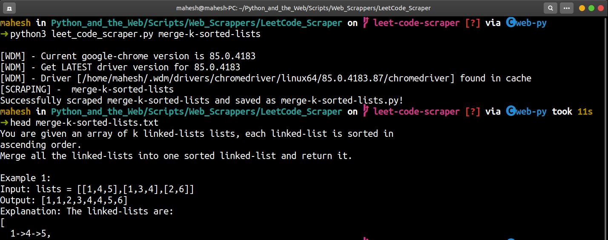

# LeetCode Scraper

Takes [LeetCode](https://leetcode.com/) problem code as command line argument scrapes the problem statement and saves it in a text file.

### Prerequisites

Installing prerequisites:
```bash
$pip install -r requirements.txt
```

### How to run the script

Running the script
```bash
$python3 leet_code_scraper.py [problem code]
```
### Screenshot/GIF showing the sample use of the script




## *Author Name*

[Mahesh Bharadwaj K](https://github.com/MaheshBharadwaj)