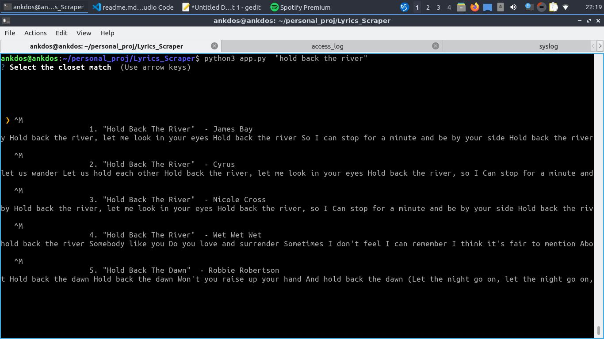
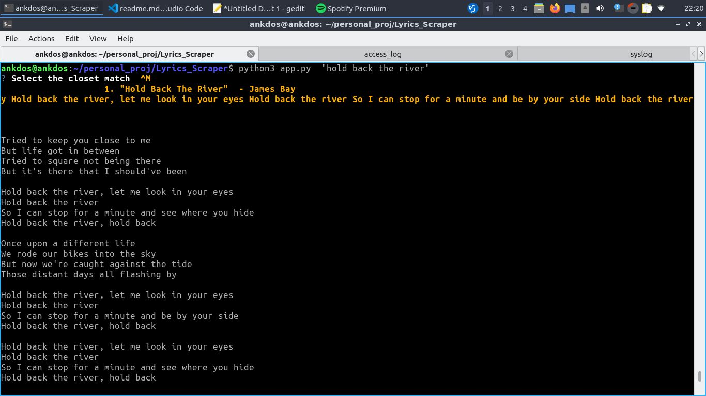

# Lyrics Scrapper 
## A python script to scrape the lyrics from https://www.azlyrics.com/ by entering song name as arg

## Setup Instructions

```

# Go to the root directoy of the project and install the requirements by typing :
  sudo pip3 install -r requirements.txt

# Run the script  by typing :
  python3 app.py "<song name>"
  
  example :  python3 app.py "hold back the river"

# A list of top matched songs will appear , chose any by using arrow key and press enter , it'll load that particular song's lyrics
```

## Screenshot taken for running the script with song name :

   

## Screenshot after selecting song from the list and pressing Enter :

   


### Author

[Ankur Pandey](https://github.com/ankdos)