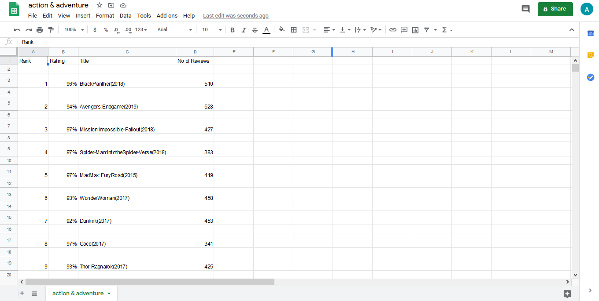
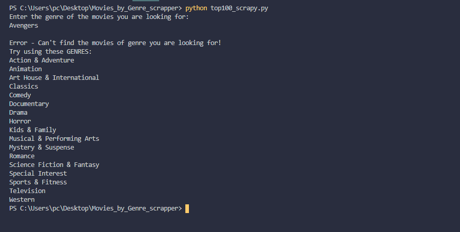

<h1 align=center> Top 100 Movies by Genre - Rotten Tomatoes Scraper</h1>

Takes A Movie Genre As A Command-Line Argument, scrapes the top 100 movies of a particular genre and stores rank,rating, title of the movie and total no of reviews in the desired csv file.

## *Author Name*
[Anshul Pandey](https://github.com/Anshul275)

## Pre-Requisites

Run The Command  `pip install -r requirements.txt`

## To Run the File

For Windows -  `python top100_scrapy.py 'movie-genre name'`

For Ubuntu/Linux - ` ./top100_scrapy.py 'movie-genre name'`

## Screenshots - 

### Generated CSV File

### If movie related to the entered genre is not found

