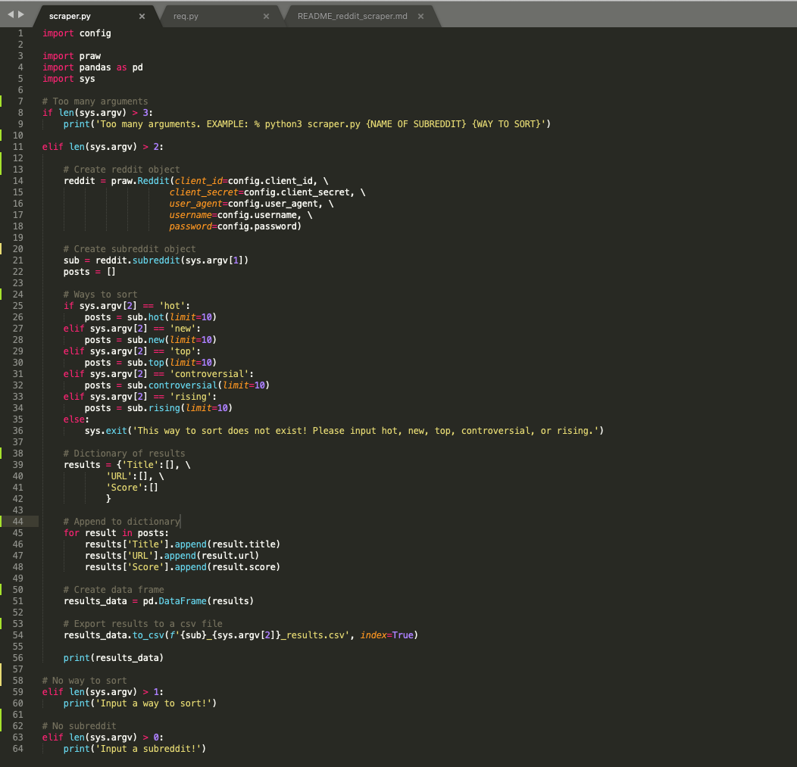

# Reddit Scraper
This script scrapes subreddits based on how you sort them.

### Prerequisites
Install the requirements like the following line:
pip3 install -r requirements.txt

### How to run the script
Run the following command with the subreddit and way to sort
python3 scraper.py {name of subreddit} {way to sort (hot, new, top, controversial, rising}

### Screenshot

## Author Name
[Daniel Jo](https://github.com/danieljo09)
