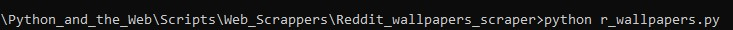

# r_wallpapers.py
Save the top 5 posts from 'hot' from the wallpapers subreddit.

### Prerequisites
```pip install praw```
### How to run the script
pyton r_wallpapers.py

### Screenshot/GIF showing the sample use of the script


## *Author Name*
Made with ♥ by [valterm](github.com/valterm)