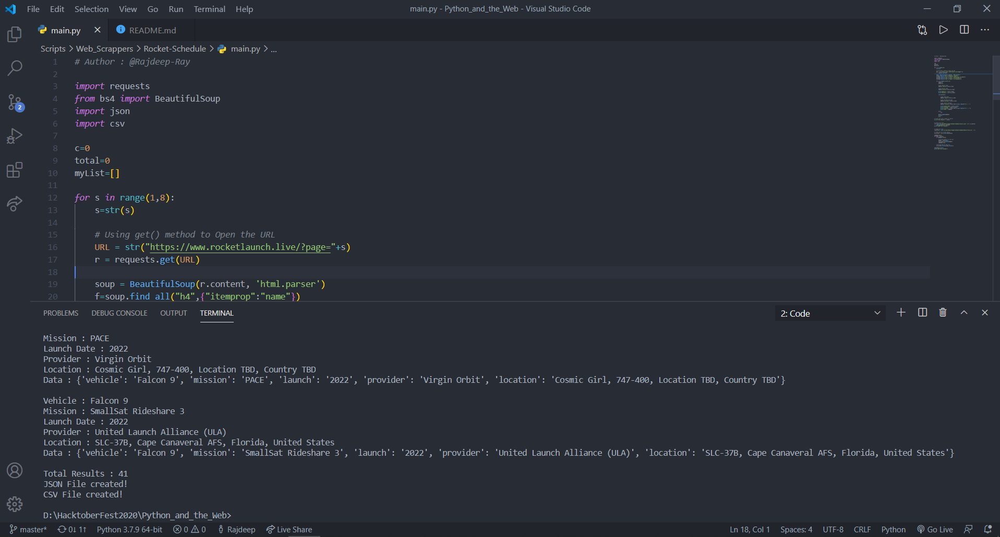
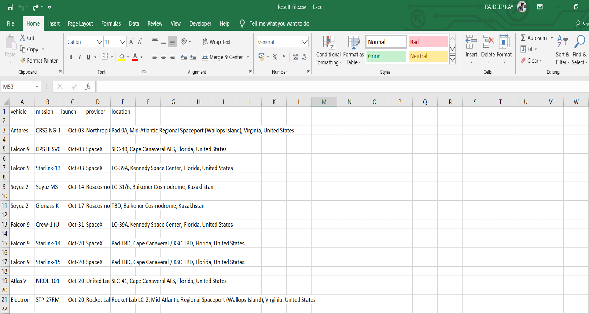
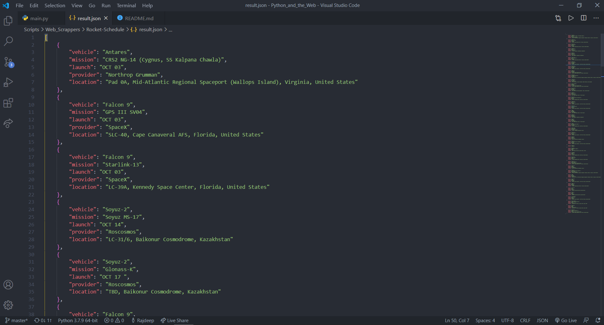

# Upcoming Rocket Launch Schedule

This script scrapes the upcoming Rocket Launch Schedule and saves it into a json and csv File

What it does?
* Scrapes all launch Schedule from https://www.rocketlaunch.live website
* Dumps them into json and csv file 

## Pre-Requisites

Run The Command 

`pip install -r requirements.txt`

## Instructions To Run

Run The Command in windows

`python main.py`

## Screenshot - Sample Use

## *Author Name*
[Rajdeep Ray](https://github.com/Rajdeep-Ray)
