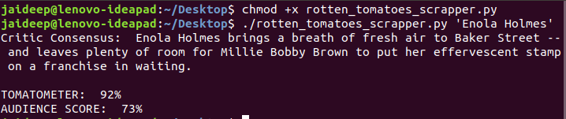

# Rotten Tomatoes Scraper

Takes A Movie Name As A Command-Line Argument, Scrapes The Appropriate Movie, And Outputs The TOMATOMETER Reading And AUDIENCE SCORE.

## Pre-Requisites

Run The Command 

`pip install -r requirements.txt`

## Instructions To Run

Run The Command in windows

`python rotten_tomatoes_scrapper.py 'movie name'`

Run The Command in ubuntu

` chmod +x rotten_tomatoes_scrapper.py`
` ./rotten_tomatoes_scrapper.py 'vaild movie name'`

## Screenshot - Sample Use

## *Author Name*
[Jaideep Reddy Kotla](https://github.com/Jaideep07)
