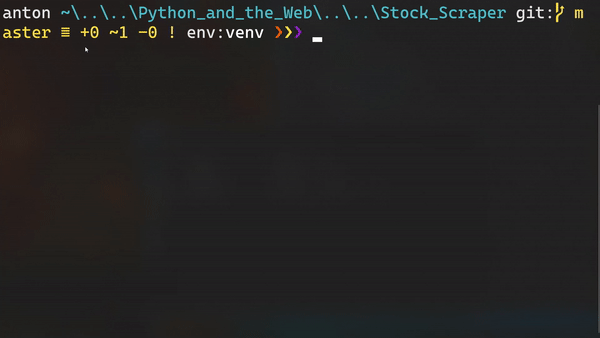

# S&P 500 scraper

This is a simple web scraper that collects information about the 500 companies listed in the S&P index

## Installation

Create a virtual environment for the script:

    python -m venv venv

and activate it:

    .\venv\Scripts\activate # Windows
or 
    
    source venv\bin\activate # Linux

Install the requirements:

    pip install -r requirements.txt

To run the script: 

    python pycon_proposals.py