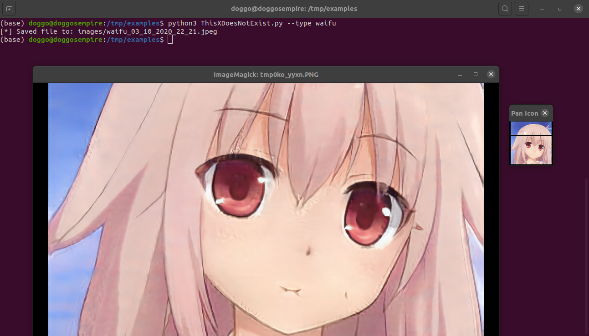
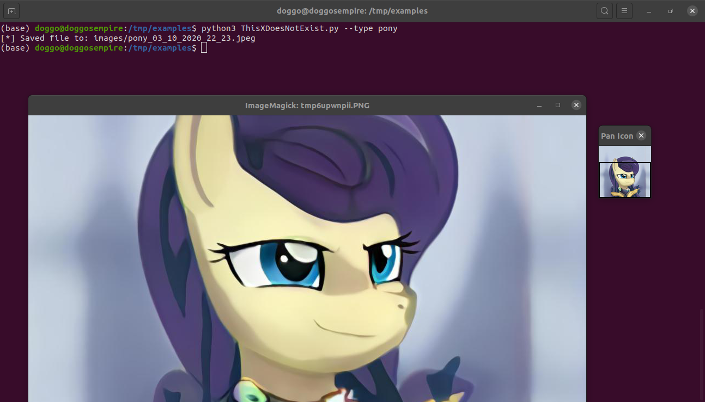
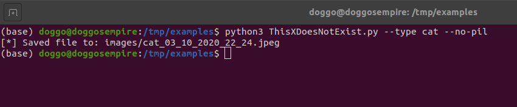

# This X does not exist

Generate photos of dogs, cats, politicians or even horses that do not exist.

## Prerequisites

- [ ] Run `pip3 install -r requirements.txt`

## How to run the script

Try generating a photo with `python3 ThisXDoesNotExist.py -t dog`

Bonus points if you are on linux and do `chmod +x ThisXDoesNotExist.py` and `./ThisXDoesNotExist.py -t dog`

You can always check out all the types of photos / other parameters with `python3 ThisXDoesNotExist.py -h`

Here are some examples:

Get an image of a waifu, show and save it:

*python3 ThisXDoesNotExist.py -t waifu*

Get an image of a pony, show and save it:

*python3 ThisXDoesNotExist.py --type pony*

Get an image of cat and save it without showing it:

*python3 ThisXDoesNotExist.py --type cat --no-pil*

## Notes

- If you do not have Pillow installed it *should* works anyways but it won't show the image
- Sometimes, when generating dog images, you'll get something like this and it won't show an image. That's because *sometimes* the api gives a `.mp4` file which Pillow  doesn't supoort. Other times the same dog api could give a `.gif` file, in that case the gif will be shown static (the first frame) but it'll saved like a normal gif, not just the first frame.
  
  ```
  [*] Saved file to: images/myfile.jpg
  [-] Unable to show the photo (probably because it's a video)! Image extension: mp4
  ```
