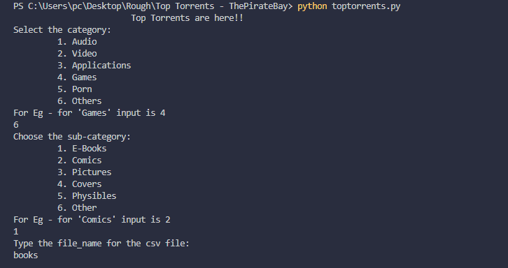
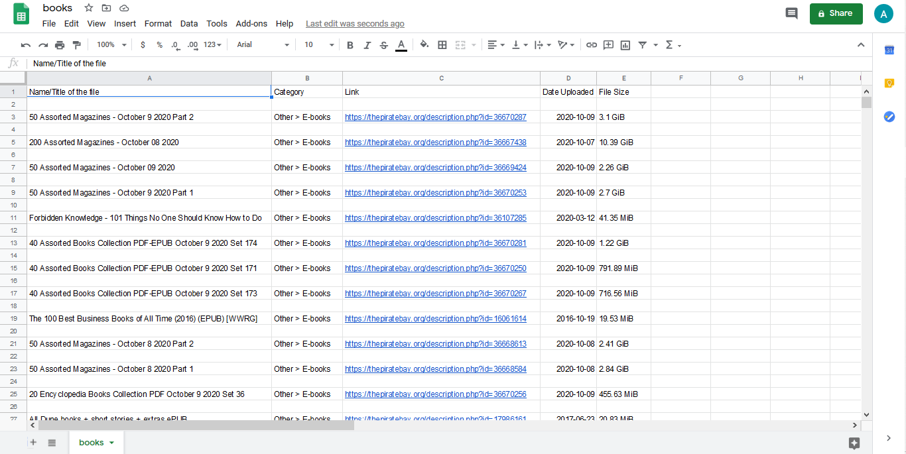

<h1 align=center>Top Torrents - The Pirate Bay</h1>

Scrapes all the top torrents of a particular category from `ThePirateBay` Website  
and stores the info in csv file (`csv-filename` is entered by the user).

## *Author Name*
[Anshul Pandey](https://github.com/Anshul275)

## Pre-Requisites

Run The Command  `pip install -r requirements.txt`

### To install the chrome web-driver:
`1.` Check the chrome-version you are currently using `chrome://settings/help`  
`2.` Download the desired Chrome web-driver for your version `https://chromedriver.chromium.org/downloads` and extract the zip file
  
`IMP` - Add the full path of the `chromedriver.exe` file in `driver_path` variable of `devfest_schedule.py` file

## To Run the File

For Windows -  `python toptorrents.py`

For Ubuntu/Linux - `python3 toptorrents.py`

## Screenshots - 

### Working Screenshot

### Generated TopTorrents csv file as per the category

