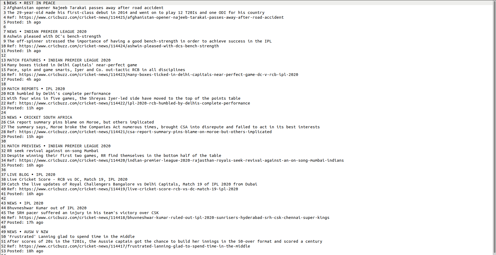

# Cricbuzz - Latest Cricket News (Top 10)

Scrapes the cricbuzz website and stores the latest Cricket News in `out.txt` file

## Pre-Requisites

Run The Command  `pip install -r requirements.txt`

## To Run the File

For Windows -  `python main.py`

For Ubuntu/Linux - `python3 main.py`

## Screenshots - 

### Screenshot of the generated .txt file

## *Author Name*

[Kartavya Shankar](https://github.com/kartavyashankar)