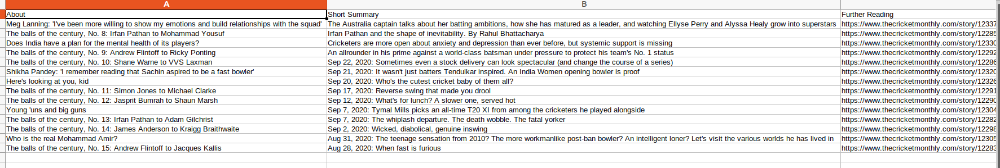
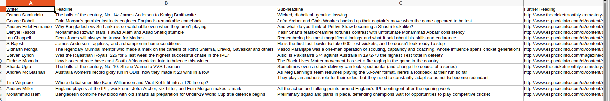

# Cricket Monthly - Latest Articles

Scrapes thecricketmonthly website and stores the Latest Published Articles in `Latest Articles from Cricket Monthly.csv` file and the articles from some of the top writers in `Articles from Top Writers.csv` file

## Pre-Requisites

Run The Command  `pip install -r requirements.txt`

## To Run the File

For Windows -  `python main.py`

For Ubuntu/Linux - `python3 main.py`

## Screenshots - 

### Screenshot of the generated `Latest Articles from Cricket Monthly.csv` file

### Screenshot of the generated `Articles from Top Writers.csv` file

## *Author Name*

[Kartavya Shankar](https://github.com/kartavyashankar)