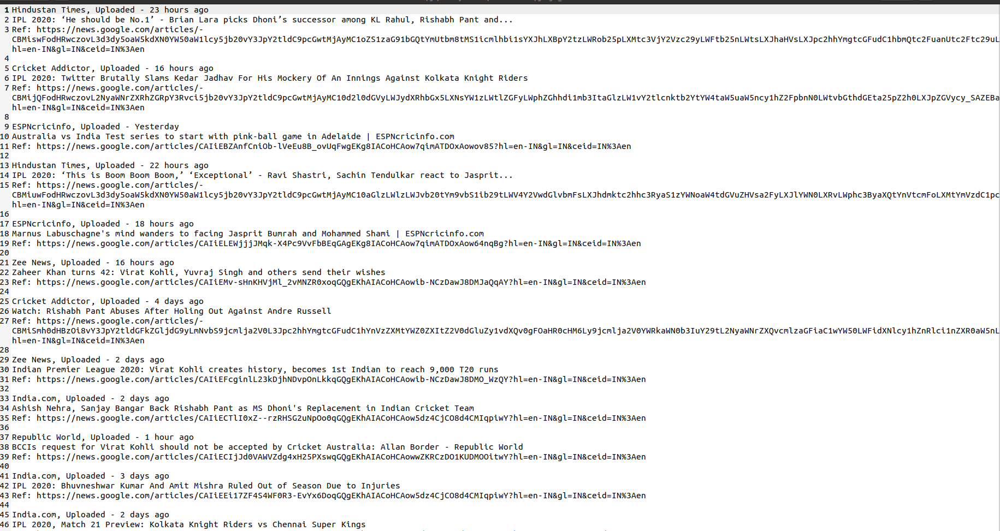

# Google News - Latest News from all over world (involves user interaction)

Scrapes the google news website and stores the latest World News in `world_news.txt` file and user defined custom news set in `custom_news.txt`. 

## Pre-Requisites

Run The Command  `pip install -r requirements.txt`

## To Run the File

For Windows -  `python main.py`

For Ubuntu/Linux - `python3 main.py`

## Screenshots - 

### Screenshot of the generated `world_news.txt` file

### Screenshot of the generated `custom_news.txt` file

## *Author Name*

[Kartavya Shankar](https://github.com/kartavyashankar)
