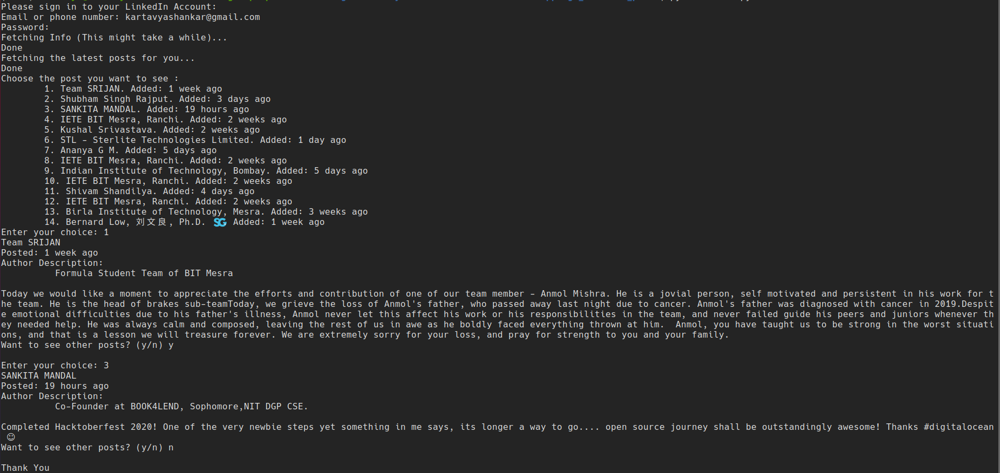

# LinkedIn - Latest Posts (Based on User Interaction)

Scrapes user's LinkedIn profile and displays the latest Posts accordingly (Does not include images and videos).

## Pre-Requisites

Run The Command  `pip install -r requirements.txt`

## To Run the File

For Windows -  `python main.py`

For Ubuntu/Linux - `python3 main.py`

## Screenshots - 

### Screenshot of the console interaction

## *Author Name*

[Kartavya Shankar](https://github.com/kartavyashankar)