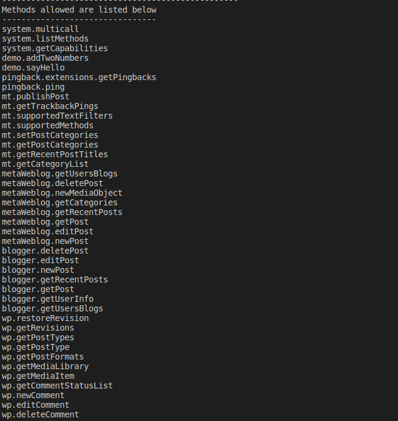
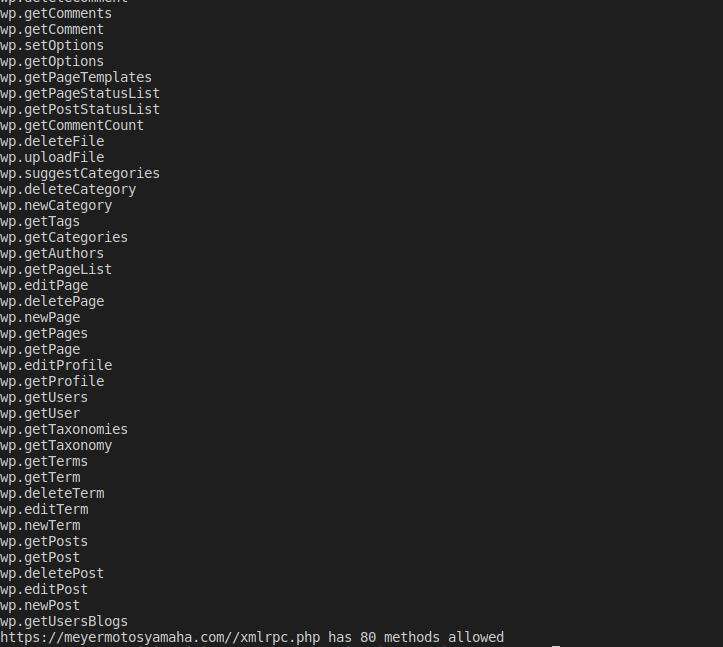

# Tool XML-RPC wordpress

This script scrapes the sites.json file to find if these sites allow requests and commands executed for xml-rpc
What it does?
* Scrapes all sites in sites.json 
* Print if theses sites allows petitions and print the methods that sites allow 

## Pre-Requisites

Python >=3.7

Run The Command 

`pip install -r requirements.txt`

Edit the file sites.json

`{"url_site":"http://yoursitetest.com"}`

## Instructions To Run

Run The Command 

`python xml_tool.py`

## Screenshot - Sample Use

## *Author Name*
[Jairo Castañeda](https://github.com/jairoufps)
